::: {align="center"}
``{=html}
`<a href="https://readme-typing-svg.demolab.com">`{=html}<div align="center">


<br/>

[](https://github.com/kunalchwdry)
[](https://www.linkedin.com/in/kunal-choudhary-918270425/)
[](https://github.com/kunalchwdry/Questbound)


### AI engineer in progress. Systems thinker by habit. Builder by default.

**I build systems where AI meets real software engineering.**

From secure backend architecture and data pipelines to voice AI,
adaptive productivity systems, and intelligent applications.

`BE Artificial Intelligence & Data Science` · `India` · `Mission 2030`

</div>

---

```text
┌──(kunal㉿forge-x)-[~/mission-2030]
└─$ ./status --verbose

  IDENTITY      AI ENGINEER IN PROGRESS
  SPECIALTY     Intelligent Systems · Backend · Applied AI
  PRINCIPLE     Foundations first. Validate before you claim.
  LOOP          BUILD → MEASURE → LEARN → SHIP → REPEAT

  ACTIVE QUESTS
  ├── Secure software architecture
  ├── Applied AI and ML
  ├── Adaptive productivity systems
  └── Real-world engineering

  FINAL BOSS    AI INFRASTRUCTURE [NOT DEFEATED]
  STATUS        MISSION 2030 — IN PROGRESS
```

# `01` / THE PLAYER

<table>
<tr>
<td width="60%" valign="top">

I'm a second-year BE Artificial Intelligence & Data Science student focused on building the engineering foundations behind useful AI products.

My interests span **LLM applications, backend engineering, machine learning, data science, voice AI, automation, and embedded speech processing**.

I care about more than making a demo work. I care about what happens underneath it:

- Is the data trustworthy?
- Are permissions enforced on the server?
- Are important state changes consistent?
- Can the results be reproduced?
- Are limitations documented honestly?
- Does the system behave correctly when something fails?

My goal is to grow from building AI-powered applications into designing reliable intelligent systems end-to-end.

**North star:** AI Engineering → Intelligent Systems → AI Products → AI Infrastructure.

</td>
<td width="40%" valign="top">

```yaml
player: Kunal Choudhary
class: AI Engineer
level: 02 → 99
guild: Forge-X
quest: Mission 2030

loadout:
  language: Python
  backend: FastAPI / Next.js
  data: PostgreSQL / Supabase
  intelligence: LLMs / NLP
  voice: STT → LLM → TTS
  testing: Automated validation

core_stats:
  curiosity: HIGH
  consistency: TRAINING
  systems_thinking: ACTIVE
  evidence: REQUIRED

final_boss:
  name: AI Infrastructure
  status: ACTIVE
```

</td>
</tr>
</table>

> **Player philosophy:** Don't just use intelligent tools. Understand, evaluate, and engineer the systems behind them.

---

# `02` / CURRENT OPERATIONS

<table>
<tr>
<th>Mission</th>
<th>Objective</th>
<th>Focus</th>
</tr>
<tr>
<td><a href="https://github.com/kunalchwdry/FlowCare"><b>FlowCare</b></a></td>
<td>Hospital discovery and outpatient coordination</td>
<td>Data provenance, PostgreSQL, RLS, secure workflows</td>
</tr>
<tr>
<td><a href="https://github.com/kunalchwdry/Traxis"><b>TRAXIS</b></a></td>
<td>Polar expedition logistics and asset management</td>
<td>Multi-tenancy, JWT, RBAC, operational data</td>
</tr>
<tr>
<td><a href="https://github.com/kunalchwdry/Questbound"><b>Questbound</b></a></td>
<td>Adaptive productivity RPG</td>
<td>Gamification, server-authoritative progression, AI companion</td>
</tr>
<tr>
<td><a href="https://github.com/kunalchwdry/data-vortex-2026"><b>DataVortex</b></a></td>
<td>Three-round data science pipeline</td>
<td>Data restoration, NLP, statistical analysis</td>
</tr>
<tr>
<td><a href="https://github.com/kunalchwdry/InnerLoop"><b>InnerLoop</b></a></td>
<td>Student productivity and continuous improvement</td>
<td>Planning, habits, focus, analytics</td>
</tr>
<tr>
<td><b>Mission 2030</b></td>
<td>Long-term engineering progression</td>
<td>Foundations, disciplined practice, real projects</td>
</tr>
</table>

**Operating principle:** A feature is not finished because it works once. It is finished when its behavior, boundaries, and failure modes are understood.

---

# `03` / THE GAMIFICATION STACK

Three layers. Three different jobs. One continuous improvement loop.

<div align="center">

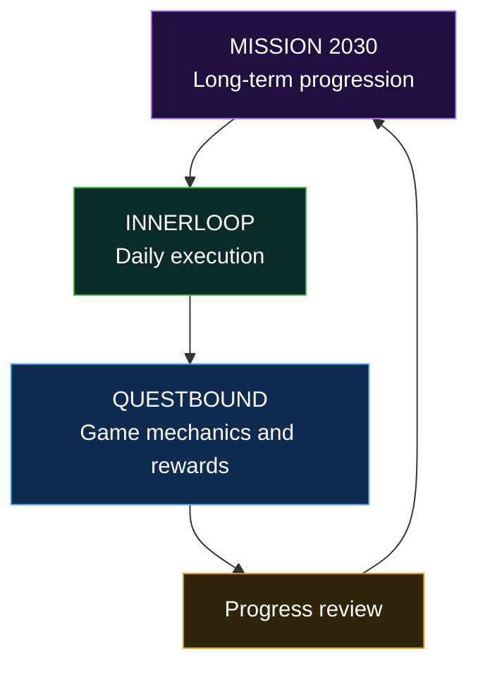

</div>

## 🎮 01 — Questbound

**The RPG engine**

[](https://github.com/kunalchwdry/Questbound)

Questbound turns productivity into a game system built around quests, XP, gold, attributes, streaks, and an AI companion called the Oracle.

🏆 **Tech Zephyr 4.0 — Grand Finale Finalist, IIT Bhubaneswar**

**Core concepts:**

- Quests that turn goals into actionable tasks.
- XP, gold, attributes, and progression.
- Streak-based consistency mechanics.
- An AI companion with multi-provider routing.
- Lightweight local Naive Bayes emotion classification.
- Server-authoritative reward calculation.
- Transactional progression updates.
- Architecture decision records and automated testing.

**Engineering principle:** The client can request a reward-triggering action; the server validates it and determines the outcome.

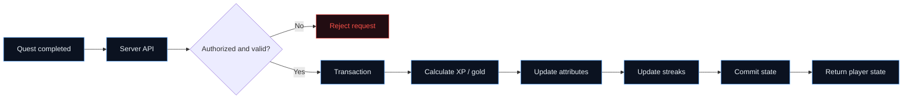

**Stack:** Next.js · React · PostgreSQL · Supabase · Drizzle ORM · Multi-provider LLM routing · Naive Bayes

---

## 🔁 02 — InnerLoop

**The execution and feedback engine**

[](https://github.com/kunalchwdry/InnerLoop)

InnerLoop explores the connection between planning, focus, habits, learning, and measurable improvement.

Where Questbound emphasizes RPG mechanics, InnerLoop focuses on the structure of everyday execution and the feedback needed to improve it.

**Core concepts:**

- Timetable and daily-context awareness.
- Task and goal organization.
- Habits and focus tracking.
- Learning progress.
- Analytics and review.
- Adaptive-planning foundations.
- Structured data for future AI reasoning.

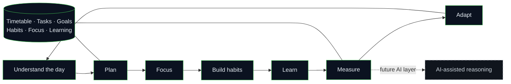

**Stack:** React · Vite · Supabase · PostgreSQL · Tailwind CSS

**Status distinction:** The full AI context and reasoning layer is a planned direction, not a claim that every AI feature has already been implemented.

---

## 🧭 03 — Mission 2030

**The personal progression layer**

Mission 2030 is my long-term framework for turning the goal of becoming a strong AI engineer into a sequence of increasingly difficult engineering challenges.

It is the overarching personal quest that connects my learning, projects, experiments, and technical growth. It is **not presented as a separate software product**.

**Progression path:**

| Stage | Focus |
|---|---|
| Foundation | Programming, data structures, databases, operating systems |
| Applied engineering | APIs, testing, security, deployment, data pipelines |
| Applied AI | ML, deep learning, NLP, model evaluation |
| Intelligent systems | LLM applications, retrieval, agent workflows |
| Systems engineering | Reliability, architecture, observability, infrastructure |


The objective is not to collect badges for their own sake. It is to use structured goals, visible progress, and feedback to build real capability.

> **The complete loop:** Mission 2030 defines the direction. InnerLoop organizes the work. Questbound experiments with making progress engaging.

---

# `04` / ENGINEERING PHILOSOPHY

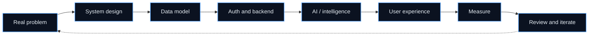

- **Foundations before features.** Data models, validation, and access control come before AI glitter.
- **The server owns critical state.** Permissions, reward calculations, and important transitions should be enforced server-side.
- **Structured context beats prompt chaos.** Useful intelligence depends on well-modeled inputs and explicit constraints.
- **Failures are part of the product.** Loading, empty, unauthorized, stale, and error states deserve deliberate behavior.
- **Evidence over impressive numbers.** Metrics require reproducible methods, clear denominators, and honest limitations.
- **AI is a component, not the architecture.** The surrounding system determines whether intelligence is useful and reliable.

---

# `05` / PROJECT ARCHIVE

## ◈ FlowCare

### Provenance-first healthcare discovery and outpatient coordination

[](https://github.com/kunalchwdry/FlowCare)
[](https://flowcare-five.vercel.app)

FlowCare treats hospital discovery as a data provenance and trust problem, not merely a directory problem.

**Features and engineering areas:**

- Hospital discovery by locality, specialty, service, and plain-language intent.
- Appointment request and confirmation workflows.
- Hospital-side operational views scoped to staff access.
- Appointment-derived waiting and consultation signals.
- Patient history and reliability outcomes based on appointment events.
- AI-assisted search intent extraction.
- PostgreSQL Row Level Security and relationship-scoped access.
- Explicit data freshness and unavailable states.

**Stack:** Next.js 15 · TypeScript · Tailwind CSS · Supabase · PostgreSQL · RLS · Zod · Vitest · Vercel

**Honest status:** Production behavior depends on deployed database migrations and live-path verification. Demo-backed flows should not be mistaken for verified live hospital operations.

---

## ◈ TRAXIS

### Polar expedition logistics and asset management

[](https://github.com/kunalchwdry/Traxis)

**Smart India Hackathon 2026 · Problem Statement 26062 · MoES / NCPOR**

TRAXIS explores a multi-tenant operational platform for polar expeditions, with workflows around personnel, cargo, assets, inventory, incidents, and organization access.

**Architecture priorities:**

- Server-side JWT verification.
- Role-based authorization.
- Tenant-scoped operations.
- PostgreSQL RLS as a second access-control layer.
- Operational lifecycle management.
- Auditability and integration testing.

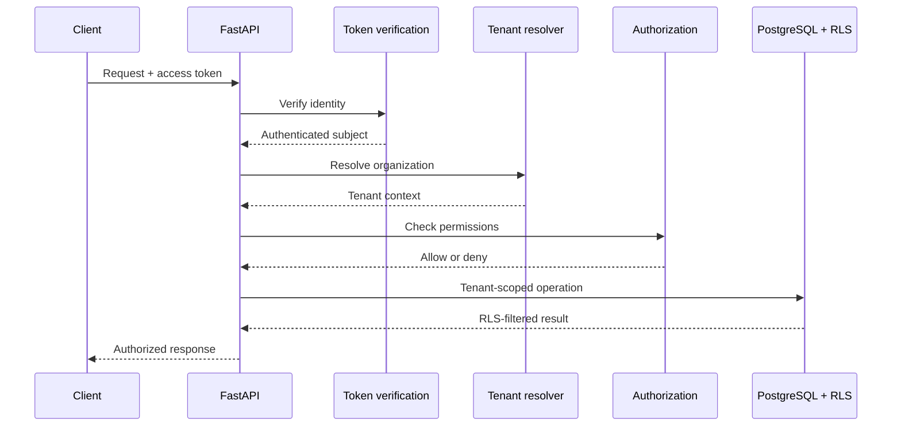

**Stack:** React · Vite · TypeScript · FastAPI · PostgreSQL · Supabase · JWT · RBAC · RLS

---

## ◈ Questbound

### Adaptive productivity RPG

Questbound combines structured productivity with RPG mechanics and an AI companion.

**Focus areas:** server-authoritative progression, transactional state updates, Oracle companion routing, local classification, architecture decision records, and automated testing.

**Stack:** Next.js · React · PostgreSQL · Supabase · Drizzle ORM · Multi-provider LLM routing · Naive Bayes

[Explore Questbound →](https://github.com/kunalchwdry/Questbound)

---

## ◈ DataVortex

### A three-round national data science competition

[](https://github.com/kunalchwdry/data-vortex-2026)

**AARUUSH '26 · SRM Institute of Science and Technology · “Rebuilding the Social Engine”**

A reproducible pipeline connecting data restoration, NLP classification, and live signal tracking.

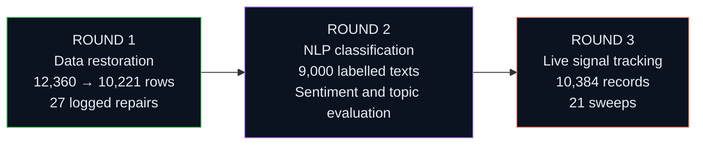

**Round 1 — Data restoration**
- Recovered 12,360 corrupted rows into 10,221 analysis-ready records.
- Logged 27 reversible data repairs.
- Used SQLite and SQL for analytical queries.
- Built a reproducible pipeline with automated tests.

**Round 2 — Semantic recovery**
- Evaluated sentiment and topic classification over 9,000 labelled texts.
- Compared TF-IDF and linear models, with LDA/NMF cross-checks.
- Reported sentiment macro-F1 of **0.6134** and topic macro-F1 of **0.8051**.
- Used a fixed split and seed with explicit error analysis.

**Round 3 — Live signal tracking**
- Collected **10,384 records** across **21 sweeps** and **5 languages**.
- Logged HTTP outcomes.
- Applied the Round 2 model to the collected data without retraining on target results.
- Reported **9 engagement spikes** and a positivity shift from **0.391 to 0.306**, with Mann–Whitney U, **p = 0.0043**.

**Stack:** Python · pandas · scikit-learn · TF-IDF · SQLite · Jupyter · Statistical testing

---

## ◈ InnerLoop

### Student productivity and continuous improvement

InnerLoop models the cycle between planning, focus, habits, learning, and measurable improvement.

**Implemented foundations:** timetable context, tasks, goals, habits, focus, learning tracking, analytics, and structured AI-ready data.

**Planned direction:** full AI context and reasoning layer.

**Stack:** React · Vite · Supabase · PostgreSQL · Tailwind CSS

[Explore InnerLoop →](https://github.com/kunalchwdry/InnerLoop)

---

## ◈ Anaya Health Assistant

### Voice-first healthcare information access

[](https://github.com/kunalchwdry/anaya-health-assistant)

Anaya explores voice-first healthcare information with a focus on Hinglish and Indian-language accessibility. It is designed to be **non-diagnostic and non-prescriptive**.

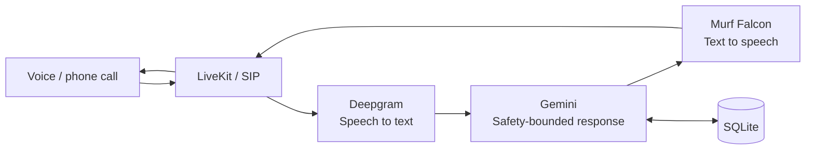

**Stack:** LiveKit Agents · SIP · Gemini · Deepgram · Murf Falcon · SQLite

---

## ◈ SHIELD-COM

### Embedded speech processing for noisy environments

**Smart India Hackathon 2026 · Team entry / college internal round**

A hardware-software concept exploring embedded speech processing and active-noise-cancellation approaches for communication in noisy environments.

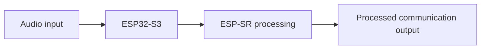

**Stack:** ESP32-S3 · ESP-SR · Embedded systems · Speech processing

The diagram represents the intended system direction, not a claim that every component is production-validated.

---

## ◈ NoLimi

### Personal AI desktop assistant

A Python assistant combining natural-language interaction with voice input, speech output, browser automation, and application launching.

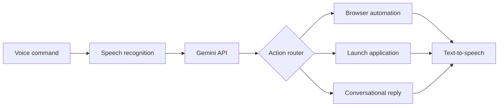

**Stack:** Python · Gemini API · Speech recognition · TTS · Browser automation

**Exploration direction:** AI, desktop automation, and cybersecurity.

---

# `06` / PROJECT CONSTELLATION

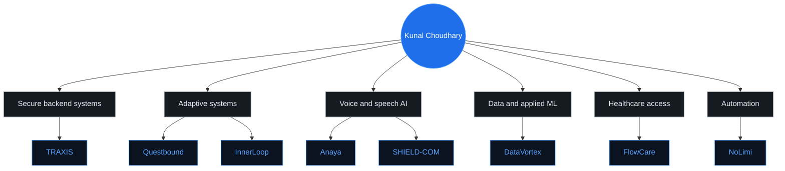

| Project | Domain | Core technologies |
|---|---|---|
| [FlowCare](https://github.com/kunalchwdry/FlowCare) | Healthcare discovery and coordination | Next.js, TypeScript, Supabase, PostgreSQL, RLS |
| [TRAXIS](https://github.com/kunalchwdry/Traxis) | Polar logistics and asset management | React, FastAPI, PostgreSQL, JWT, RBAC |
| [Questbound](https://github.com/kunalchwdry/Questbound) | Adaptive productivity RPG | Next.js, Supabase, PostgreSQL, Drizzle, LLM routing |
| [InnerLoop](https://github.com/kunalchwdry/InnerLoop) | Student productivity | React, Vite, Supabase, PostgreSQL |
| [DataVortex](https://github.com/kunalchwdry/data-vortex-2026) | Data science and live analysis | Python, pandas, scikit-learn, TF-IDF, SQLite |
| [Anaya](https://github.com/kunalchwdry/anaya-health-assistant) | Voice healthcare information | LiveKit, Gemini, Deepgram, Murf |
| SHIELD-COM | Embedded speech processing | ESP32-S3, ESP-SR |
| NoLimi | Desktop assistant and automation | Python, Gemini API, speech tools |

---

# `07` / TECH ARSENAL

<div align="center">


</div>

| Layer | Tools and concepts |
|---|---|
| AI / LLM | Gemini API, LLM applications, multi-provider routing, NLP |
| Machine learning | pandas, scikit-learn, TF-IDF, model evaluation, statistical testing |
| Deep learning | PyTorch, neural networks, practical model workflows |
| Backend | Python, FastAPI, Next.js route handlers, REST APIs |
| Data | PostgreSQL, Supabase, SQLite, Drizzle ORM |
| Security | JWT verification, RBAC, tenant scoping, RLS, audit logging |
| Frontend | React, Next.js, TypeScript, Vite, Tailwind CSS |
| Voice and speech | LiveKit Agents, SIP, Deepgram, Murf Falcon, TTS |
| Embedded | ESP32-S3, on-device speech-processing exploration |
| Engineering | Git, GitHub, automated testing, reproducible pipelines |

---

# `08` / FIELD REPORTS

| Event / track | Work |
|---|---|
| **Tech Zephyr 4.0 — IIT Bhubaneswar** | Questbound selected as a Grand Finale Finalist |
| **AARUUSH '26 — DataVortex** | Three-round pipeline: restoration → NLP → live signal tracking |
| **Smart India Hackathon 2026** | Team work across TRAXIS and SHIELD-COM problem tracks |

---

# `09` / CURRENT LEARNING TREE

<details open>
<summary><b>Active learning tracks</b></summary>

| Track | Focus |
|---|---|
| ML foundations | Core concepts, data preparation, training, evaluation |
| Deep learning | PyTorch, neural networks, practical model workflows |
| LLM systems | RAG, agentic architectures, evaluation, failure analysis |
| Backend engineering | API design, authorization, testing, reliability |
| System design | Data modelling, tenant boundaries, scalable architecture |
| AI infrastructure | Deployment, observability, performance, reliability |

</details>

---

# `10` / GITHUB TELEMETRY

<div align="center">


<br/><br/>


</div>

```text
┌──(kunal㉿github)-[~/telemetry]
└─$ ./mission-report

  grand finale finalist ......... Tech Zephyr 4.0 · IIT Bhubaneswar
  competition rounds shipped .... 3 · DataVortex
  records collected ............. 10,384
  collection sweeps ............. 21
  languages in collected data ... 5
  reported statistical result ... p = 0.0043
  architecture decision records . 24+
```

<sub>Statistics cards are generated by third-party services and may occasionally be unavailable or delayed. Project metrics describe the stated project runs, not live GitHub counters.</sub>

---

# `11` / THE SIDE QUEST

*You wake up inside THE SOCIAL ENGINE. Corrupted rows shimmer across the floor. A terminal flickers in the dark.*

```text
> signal detected
> records recovered: 10,384
> anomaly probability: p = 0.0043
> new quest unlocked: MISSION 2030
```

### Choose your route

| Portal | Mission |
|---|---|
| 🗃️ [Enter the Data Caves](https://github.com/kunalchwdry/data-vortex-2026) | Follow the evidence. Repair records. Track the signal. |
| 🎙️ [Climb the Voice Tower](https://github.com/kunalchwdry/anaya-health-assistant) | Explore voice-first AI and speech pipelines. |
| 🔐 [Enter the Security Vault](https://github.com/kunalchwdry/Traxis) | Build strong tenant boundaries and authorization. |
| 🧪 [Visit the Alchemist](https://github.com/kunalchwdry/Questbound) | Explore where deterministic rules meet adaptive AI. |
| 🔁 [Enter the Inner Loop](https://github.com/kunalchwdry/InnerLoop) | Plan, focus, learn, measure, and adapt. |
| 🏥 [Open FlowCare](https://github.com/kunalchwdry/FlowCare) | Trace a claim back to its source. |

<details>
<summary>💎 <b>Secret room: The Golden Record</b></summary>

```text
☠ FINAL BOSS — MISSION 2030
TARGET: AI INFRASTRUCTURE
STATUS: ACTIVE

WEAPONS:
  [x] Foundations first
  [x] Server decides
  [x] Validate before you claim
  [x] Measure, then improve

CRITICAL HIT:
  Data integrity → Applied intelligence → Useful systems
```

**Achievement unlocked:** Keep building things that survive contact with reality.

</details>

---

# `12` / MISSION 2030

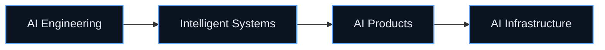

The goal is to build deep technical foundations, ship increasingly complex AI systems, and become an engineer who can design intelligent products end-to-end—from data and infrastructure to the user experience.

Not a claim that the mission is complete.

**A direction worth earning.**

---

# `13` / CONNECT

<div align="center">

[](https://github.com/kunalchwdry)
[](https://www.linkedin.com/in/kunal-choudhary-918270425/)

**Open to collaborating on AI systems, backend platforms, data pipelines, and real-world intelligent software.**


<br/>


</div>
``{=html}
`</a>`{=html}
`<br/>`{=html}


AI engineer in progress. Systems thinker by habit. Builder by default.
I build systems where AI meets real software engineering --- from
secure APIs and data pipelines to voice-first applications and adaptive
products.
BE Artificial Intelligence & Data Science · India · Mission 2030
:::
---
``` text
┌──(kunal㉿forge-x)-[~/mission-2030]
└─$ ./status --verbose

  IDENTITY      AI ENGINEER IN PROGRESS
  SPECIALTY     Intelligent systems · Backend · Applied AI
  PRINCIPLE     Foundations first. Validate before you claim.
  LOOP          BUILD → MEASURE → LEARN → SHIP → REPEAT
  FINAL BOSS    AI INFRASTRUCTURE [NOT DEFEATED]
```
`01` / THE PLAYER
```{=html}
<table>
```
```{=html}
<tr>
```
```{=html}
<td width="60%" valign="top">
```
I'm a second-year BE AI & Data Science student focused on building the
engineering foundations behind useful AI products.
My work spans LLM applications, voice AI, backend architecture, data
science, automation, and embedded speech systems. I care about what
happens underneath the demo: authorization, data quality, failure
states, reproducibility, and whether a claim can actually be verified.
Right now, I'm building and hardening projects that turn messy
real-world workflows into systems with clear rules, traceable data, and
measurable outcomes.
Current north star: AI Engineering → Intelligent Systems → AI
Products → AI Infrastructure.
```{=html}
</td>
```
```{=html}
<td width="40%" valign="top">
```
``` yaml
player: Kunal Choudhary
class: AI Engineer
level: 02 → 99
guild: Forge-X
quest: Mission 2030

loadout:
  backend: FastAPI / Next.js
  data: PostgreSQL / Supabase
  intelligence: LLMs / NLP
  voice: STT → LLM → TTS
  mindset: ship_and_verify

boss:
  name: AI Infrastructure
  status: ACTIVE
```
```{=html}
</td>
```
```{=html}
</tr>
```
```{=html}
</table>
```
`02` / CURRENT OPERATIONS
---
Mission                             What I'm working on
---
FlowCare                        Provenance-first hospital discovery
and outpatient coordination, with
patient and hospital workflows
TRAXIS                          Multi-tenant polar expedition
logistics, assets, inventory, and
operational access control
Questbound                      Adaptive productivity RPG with
server-authoritative progression
and an AI companion
DataVortex                      Reproducible, three-round data
science pipeline: restoration → NLP
→ live signal tracking
Learning track                  ML foundations, PyTorch,
evaluation, RAG, agentic systems,
and reliable backend design
> **Operating principle:** a feature is not finished because it works
> once. It is finished when its behavior, boundaries, and failure modes
> are understood.
---
`03` / ENGINEERING PHILOSOPHY
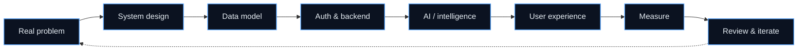
Foundations before features. Data models, server-side
validation, and access control come before AI glitter.
The server owns critical state. Permissions, rewards, and
important transitions are never trusted to the browser.
Structured context beats prompt chaos. Useful intelligence
depends on well-modeled inputs and explicit constraints.
Failures are part of the product. Loading, empty, unauthorized,
stale, and error states deserve deliberate behavior.
Evidence over impressive numbers. Metrics need a reproducible
method, a clear denominator, and honest limitations.
AI is a component, not the architecture. The surrounding system
determines whether intelligence is safe and useful.
---
`04` / PROJECT ARCHIVE
◈ FlowCare
Provenance-first healthcare discovery & outpatient coordination


FlowCare treats hospital discovery as a data provenance and trust
problem, not merely a directory problem. Claims should have a source,
verifier, and freshness context; when certainty is missing, the system
should expose the uncertainty rather than manufacture confidence.
Stack: Next.js 15 · TypeScript · Tailwind CSS · Supabase ·
PostgreSQL · RLS · Zod · Vitest · Vercel
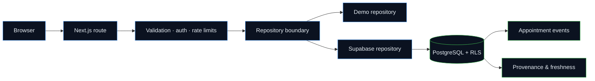
What it explores - Hospital discovery by locality, specialty,
service, and plain-language intent. - Appointment request and
confirmation workflows with server-authoritative data. - Hospital-side
operational views scoped to staff membership and appointment
relationships. - Appointment-derived waiting and consultation signals,
with explicit stale/unavailable states. - Patient visit history and
reliability outcomes based on official appointment events. - AI-assisted
search intent extraction without allowing the model to write SQL or
confirm bookings.
Engineering focus - PostgreSQL Row Level Security and
relationship-scoped access. - Validated, version-aware appointment
transitions and idempotent event handling. - Clear separation between
demo data and live database paths. - Explicit error states rather than
silently converting database failures into empty results. - Provenance
and freshness treated as data-model concerns, not just UI labels.
Honest status note: the repository includes additive migrations for
care-access truth, appointment-derived traffic, and patient reliability.
Production behavior depends on the deployed database migration and
live-path verification; demo-backed flows should not be mistaken for
verified live hospital operations.
---
◈ TRAXIS
Polar expedition logistics & asset management


Smart India Hackathon 2026 · Problem Statement 26062 · MoES / NCPOR
TRAXIS is a multi-tenant operations platform concept for polar
expedition logistics: personnel, cargo, assets, inventory, incidents,
and organization access workflows.
Stack: React · Vite · TypeScript · FastAPI · PostgreSQL · Supabase ·
JWT · RBAC · RLS
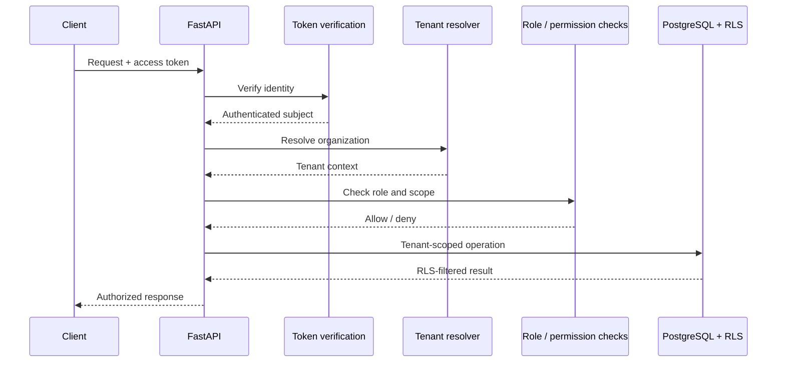
Engineering focus - Server-side JWT verification and role-based
authorization. - Organization-scoped operations and multi-tenant
boundaries. - PostgreSQL RLS as a second authorization layer. -
Operational models for expedition lifecycle, personnel, cargo, assets,
inventory, and incidents. - Audit logging and integration tests for
access and workflow behavior.
Core rule: the client can request an action; it does not get to
decide whether that action is allowed.
---
◈ Questbound
A life RPG powered by adaptive productivity systems


🏆 Tech Zephyr 4.0 --- Grand Finale Finalist, IIT Bhubaneswar
Questbound turns productivity into a game system built around quests,
XP, gold, attributes, streaks, and an AI companion called the Oracle.
Selected for the offline Grand Finale, involving a pitch, live demo, and
technical Q&A.
Stack: Next.js · React · PostgreSQL · Supabase · Drizzle ORM ·
Multi-provider LLM routing · Naive Bayes
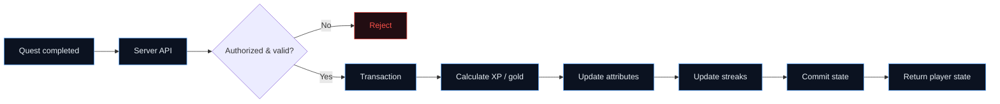
The interesting engineering - Server-authoritative reward
calculation; the browser never chooses its own rewards. - Transactional
updates for progression state. - Oracle companion with multi-provider
routing and fallback behavior. - Lightweight local Naive Bayes emotion
classification feeding structured context. - 24+ architecture decision
records documenting key system decisions. - Test hardening across pure
logic, SQL behavior, and end-to-end flows. - Additive migration workflow
with fingerprint checks and advisory locking.
Design split: deterministic code handles critical state; the LLM
sits at the product's flexible edge.
---
◈ DataVortex
A three-round national data science competition

AARUUSH '26 · SRM Institute of Science and Technology · "Rebuilding
the Social Engine"
A three-round pipeline that rebuilt a simulated social platform's data,
semantic layer, and live signal tracking. The work emphasizes
reproducibility, explicit data repairs, and honest evaluation.
Stack: Python · pandas · scikit-learn · TF-IDF · SQLite · Jupyter ·
Mann--Whitney U · public data sources
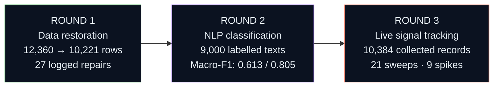
Round 1 --- Data restoration - Recovered 12,360 corrupted rows into
10,221 analysis-ready records. - Logged 27 individually justified,
reversible repairs instead of silently altering data. - Built a SQLite
analysis core and answered the analytical question set with SQL. -
Reproducible pipeline with automated tests.
Round 2 --- Semantic recovery - Evaluated sentiment and topic
classification over 9,000 labelled texts. - Compared TF-IDF and linear
models, with LDA/NMF cross-checks. - Reported sentiment macro-F1 of
0.6134 and topic macro-F1 of 0.8051. - Used a fixed split and
seed, with explicit error analysis.
Round 3 --- Live signal tracking - Collected 10,384 records
across 21 sweeps and 5 languages. - Logged HTTP outcomes and
used public sources under their applicable access constraints. - Applied
the Round 2 model to the collected data without retraining it on the
target results. - Reported 9 engagement spikes and a gold-day
positivity shift from 0.391 to 0.306 with Mann--Whitney U, p =
0.0043.
Why it matters: data integrity → applied ML → live analysis,
connected into one reproducible pipeline.
> "The data survived. It understood. Now it watches back." --- ARCHIVE
> NODE 07
---
◈ InnerLoop
Student productivity & continuous improvement
InnerLoop explores the loop between planning, focus, habits, learning,
and measurable improvement. It is a separate project from Questbound:
InnerLoop emphasizes structured planning and analytics, while Questbound
explores game mechanics.
Stack: React · Vite · Supabase · PostgreSQL · Tailwind CSS
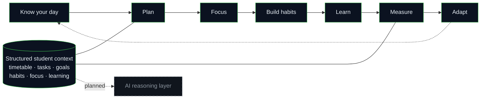
Implemented foundations: timetable context, tasks and goals, habits
and focus, learning tracking, analytics, adaptive-planning foundations,
and structured AI-ready data.
Planned: the full AI context and reasoning layer.
---
◈ Anaya Health Assistant
Voice-first healthcare information access

Anaya explores voice-first healthcare information with a focus on
Hinglish and Indian-language accessibility. It is designed to be
non-diagnostic and non-prescriptive.
Stack: LiveKit Agents · SIP · Gemini · Deepgram · Murf Falcon ·
SQLite
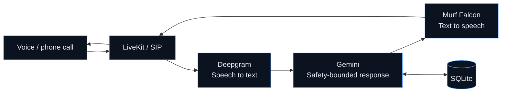
Voice-first interaction to reduce dependence on text-heavy
interfaces.
Hinglish-oriented conversational experience.
Information and guidance rather than diagnosis or prescription.
Speech-to-text → language model → text-to-speech pipeline.
---
◈ SHIELD-COM
Embedded speech processing for noisy environments
Smart India Hackathon 2026 · Team entry / college internal round
A hardware-software concept exploring embedded speech processing and
active-noise-cancellation approaches for communication in noisy
operational environments.
Stack: ESP32-S3 · ESP-SR · Embedded systems · Speech processing

The project explores the hardware/software boundary and on-device
speech-processing capabilities. The diagram represents the intended
system direction, not a claim that every component is
production-validated.
---
◈ NoLimi
Personal AI desktop assistant
A Python assistant combining natural-language interaction with voice
input, speech output, browser automation, and application launching.
Stack: Python · Gemini API · Speech recognition · TTS · Browser
automation
``` mermaid
flowchart LR
    V["Voice command"] --> SR["Speech recognition"]
    SR --> G["Gemini API"]
    G --> R{"Action router"}
    R --> B["Browser automation"]
    R --> A["Launch application"]
    R --> C["Conversational reply"]
    B --> T["Text-to-speech"]
    A --> T
    C --> T

    classDef n fill:#0b1220,stroke:#3fb950,color:#e6edf3;
    class V,SR,G,R,B,A,C,T n;
```
Exploration direction: AI + desktop automation + cybersecurity. This
is an ongoing direction, not a claim that every possible automation
feature is complete.
---
`05` / PROJECT CONSTELLATION
``` mermaid
flowchart TB
    ME(("Kunal Choudhary"))
    ME --> SEC["Secure backend systems"]
    ME --> ADP["Adaptive systems"]
    ME --> VOICE["Voice & speech AI"]
    ME --> DATA["Data & applied ML"]
    ME --> HEALTH["Healthcare access"]
    ME --> AUTO["Automation"]

    SEC --> T["TRAXIS"]
    SEC --> Q["Questbound"]
    ADP --> Q
    ADP --> IL["InnerLoop"]
    VOICE --> AN["Anaya"]
    VOICE --> SH["SHIELD-COM"]
    HEALTH --> FC["FlowCare"]
    DATA --> DV["DataVortex"]
    AUTO --> NL["NoLimi"]

    classDef root fill:#1f6feb,stroke:#58a6ff,color:#fff;
    classDef domain fill:#161b22,stroke:#8b949e,color:#e6edf3;
    classDef project fill:#0b1220,stroke:#58a6ff,color:#58a6ff;
    class ME root;
    class SEC,ADP,VOICE,DATA,HEALTH,AUTO domain;
    class T,Q,IL,AN,SH,FC,DV,NL project;
```
---
Project                                                          Domain                  Core technologies
---
FlowCare              Healthcare discovery &  Next.js, TypeScript,
coordination            Supabase, PostgreSQL,
RLS
TRAXIS                  Polar logistics & asset React, Vite, FastAPI,
management              PostgreSQL, JWT, RBAC
Questbound          Adaptive productivity   Next.js, PostgreSQL,
RPG                     Supabase, Drizzle, LLM
routing
InnerLoop                                                        Student productivity    React, Vite, Supabase,
PostgreSQL
Anaya   Voice healthcare        LiveKit, Gemini,
information             Deepgram, Murf
SHIELD-COM                                                       Embedded speech         ESP32-S3, ESP-SR
processing
NoLimi                                                           Desktop assistant &     Python, Gemini API,
automation              speech tools
DataVortex    Data science & live     pandas, scikit-learn,
analysis                TF-IDF, SQLite
---
`06` / TECH ARSENAL
::: {align="center"}
``{=html}
:::
---
Layer                               Tools & concepts
---
AI / LLM                        Gemini API, multi-provider routing,
NLP, Naive Bayes, LLM applications
Machine learning                pandas, scikit-learn, TF-IDF,
evaluation, statistical testing,
Jupyter
Voice & speech                  LiveKit Agents, SIP, Deepgram, Murf
Falcon, speech recognition, TTS,
ESP-SR
Backend                         Python, FastAPI, Next.js route
handlers, REST APIs, validation,
integration testing
Data                            PostgreSQL, Supabase, SQLite, RLS,
Drizzle ORM, transactional
workflows
Security                        JWT verification, RBAC, tenant
scoping, audit logging, server-side
authorization
Frontend                        React, Next.js, TypeScript, Vite,
Tailwind CSS
Embedded                        ESP32-S3, on-device
speech-processing exploration
Workflow                        Git, GitHub, automation,
reproducible pipelines
---
`07` / FIELD REPORTS
---
Event / track                       Work
---
Tech Zephyr 4.0 --- IIT           🏆 Questbound selected as a Grand
Bhubaneswar                       Finale Finalist; offline pitch,
demo, and technical Q&A
AARUUSH '26 --- DataVortex      Three-round pipeline: restoration →
NLP → live signal tracking
Smart India Hackathon 2026      Team work across TRAXIS and
SHIELD-COM problem tracks
`08` / CURRENT LEARNING TREE
```{=html}
<details open>
```
```{=html}
<summary>
```
`<b>`{=html}Active learning tracks`</b>`{=html}
```{=html}
</summary>
```
`<br/>`{=html}
---
Track                               Current focus
---
ML foundations                  Core concepts, data preparation,
training and evaluation
Deep learning                   PyTorch, neural networks, practical
model workflows
LLM systems                     RAG, agentic architectures,
evaluation, failure analysis
Backend engineering             API design, authorization, testing,
reliability
System design                   Data modeling, tenant boundaries,
scalable architecture
```{=html}
</details>
```
---
`09` / GITHUB TELEMETRY
::: {align="center"}
``{=html}
`<br/>`{=html}`<br/>`{=html}
``{=html}
``{=html}
``{=html}
:::
``` text
┌──(kunal㉿github)-[~/telemetry]
└─$ ./mission-report

  grand finale finalist ......... Tech Zephyr 4.0 · IIT Bhubaneswar
  competition rounds shipped .... 3 · DataVortex
  records collected ............. 10,384
  collection sweeps ............. 21
  languages in collected data ... 5
  reported statistical result ... p = 0.0043
  architecture decision records . 24+
```
`<sub>`{=html}Stats cards are generated by third-party services and may
occasionally be unavailable or delayed. Project metrics above describe
the stated project runs, not live GitHub counters.`</sub>`{=html}
---
`10` / THE SIDE QUEST
You wake up inside THE SOCIAL ENGINE. Corrupted rows shimmer across the
floor. A terminal flickers in the dark:
``` text
> signal detected
> records recovered: 10,384
> anomaly probability: p = 0.0043
> new quest unlocked: MISSION 2030
```
Choose your route:
---
Portal                              Mission
---
🗃️ Enter the Data                  Follow the evidence. Repair the
Caves                 records. Track the signal.
🎙️ Climb the Voice                 Explore voice-first AI and speech
Tower     pipelines.
🔐 Enter the Security              Cross the tenant boundary without
Vault                     breaking authorization.
🧪 Visit the                       Build systems where deterministic
Alchemist             rules meet adaptive AI.
🏥 Open FlowCare       Trace a claim back to its source.
```{=html}
<details>
```
```{=html}
<summary>
```
💎 `<b>`{=html}Secret room: The Golden Record`</b>`{=html}
```{=html}
</summary>
```
`<br/>`{=html}
``` text
☠ FINAL BOSS — MISSION 2030
TARGET: AI INFRASTRUCTURE
STATUS: ACTIVE

WEAPONS:
  [x] foundations first
  [x] server decides
  [x] validate before you claim
  [x] measure, then improve

CRITICAL HIT:
  Data integrity → applied intelligence → useful systems
```
Achievement unlocked: keep building things that survive contact with
reality.
```{=html}
</details>
```
---
`11` / MISSION 2030
``` mermaid
flowchart LR
    A["AI Engineering"] --> B["Intelligent Systems"]
    B --> C["AI Products"]
    C --> D["AI Infrastructure"]

    classDef n fill:#0b1220,stroke:#58a6ff,color:#e6edf3,stroke-width:1.5px;
    class A,B,C,D n;
```
The goal is to build deep technical foundations, ship increasingly
complex AI systems, and become an engineer who can design intelligent
products end-to-end --- from data and infrastructure to the user
experience.
Not a claim that the mission is complete. A direction worth earning.
---
`12` / CONNECT
::: {align="center"}


Open to collaborating on AI systems, backend platforms, data
pipelines, and real-world intelligent software.
``{=html}
`<br/>`{=html}
``{=html}
:::
