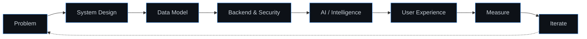
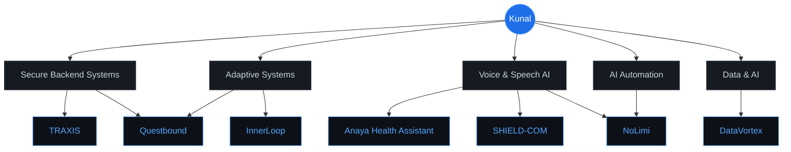
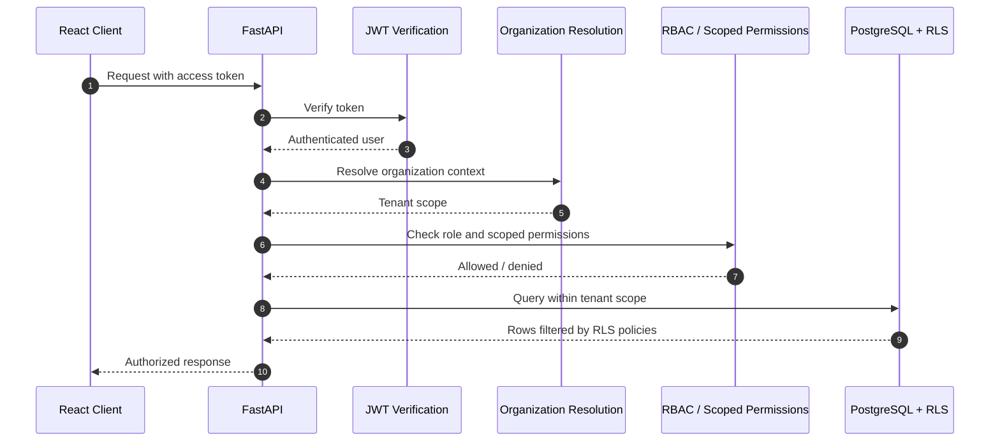
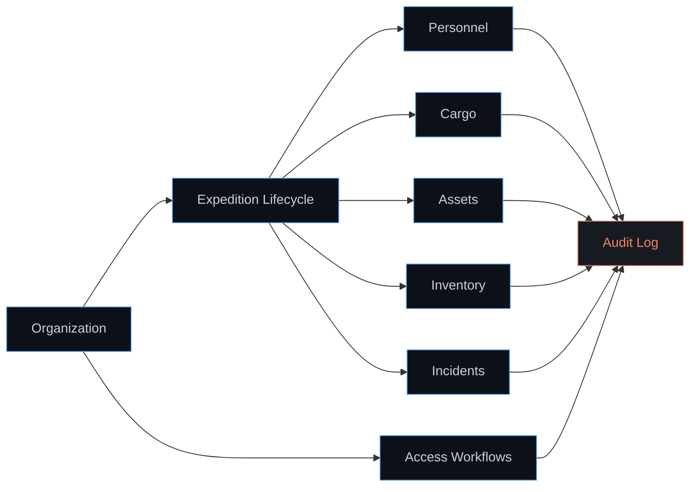
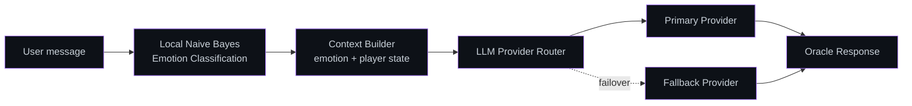
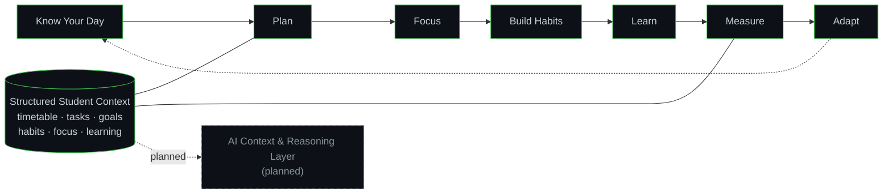
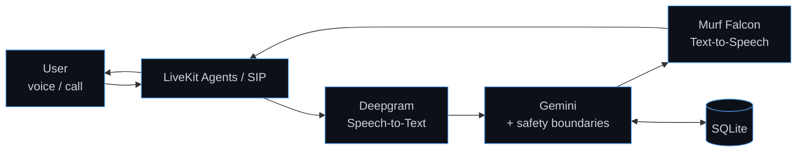
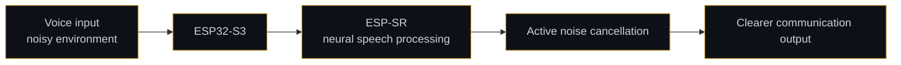
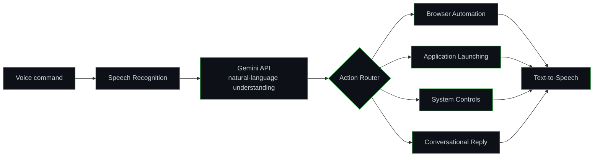
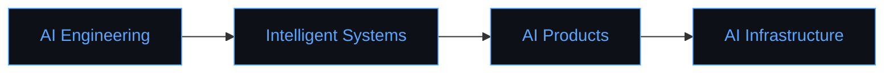

<div align="center">

# Kunal Choudhary

<a href="https://github.com/kunalchwdry">
  
</a>

**AI Engineer in Progress · AI Builder · Backend & Intelligent Systems**

I build intelligent systems that connect **AI, software engineering, data, automation, and real-world workflows**.<br/>
2nd-year BE AI & Data Science student from India, working across LLM applications, voice AI, secure backends, and adaptive systems.

[](https://github.com/kunalchwdry)
[](#connect)


[Currently Building](#currently-building) · [Philosophy](#engineering-philosophy) · [Projects](#featured-projects) · [Tech Stack](#tech-stack) · [GitHub Activity](#github-activity) · [Mission 2030](#mission-2030)

</div>

---

## About

```yaml
name: Kunal Choudhary
role: AI Engineer in Progress
education: BE Artificial Intelligence & Data Science (2nd year)
location: India

direction: AI Engineering → Intelligent Systems → AI Products → AI Infrastructure

builds:
  - Secure backend platforms (JWT, RBAC, PostgreSQL RLS)
  - Server-authoritative transactional systems
  - LLM-powered and voice-first applications
  - Adaptive productivity systems
  - Desktop and workflow automation
  - Embedded speech-processing systems

approach: building → learning → experimenting → shipping
mission: 2030
```

---

## Currently Building

| Area | What that looks like in my projects |
|---|---|
| `AI / LLM Applications` | Gemini-powered assistants, multi-provider LLM architecture with failover |
| `Voice AI` | Conversational voice pipelines with STT → LLM → TTS |
| `Backend Engineering` | FastAPI services, JWT auth, RBAC, audit logging, integration testing |
| `Data Systems` | PostgreSQL / Supabase schema design, Row Level Security, transactional logic |
| `Adaptive Systems` | Productivity loops that plan, measure, and adapt |
| `Automation` | Voice-driven desktop control, browser automation, app launching |
| `Embedded AI` | ESP32-S3 + ESP-SR speech processing and noise cancellation |

---

## Engineering Philosophy

I don't treat AI as a feature bolted onto an app. Intelligence is only as reliable as the data, backend, and authorization layers underneath it.



- **Foundations first** — schema design, server-side validation, and access control before AI.
- **Structured context over loose prompts** — AI works better when it reasons over well-modeled data.
- **Server-authoritative logic** — critical state (permissions, rewards, records) is never trusted to the client.

---

## Featured Projects

### Project Map



### Overview

| Project | Domain | Core Stack | Repository |
|---|---|---|---|
| **TRAXIS** | Polar expedition logistics & asset management | React · Vite · TypeScript · FastAPI · PostgreSQL · Supabase | [Traxis](https://github.com/kunalchwdry/Traxis) |
| **Questbound** | Life RPG / gamified adaptive productivity | Next.js · React · PostgreSQL · Supabase · Drizzle ORM | [Questbound](https://github.com/kunalchwdry/Questbound) |
| **InnerLoop** | Student productivity & continuous improvement | React · Vite · Supabase · PostgreSQL · Tailwind CSS | — |
| **Anaya Health Assistant** | Voice AI for healthcare access | LiveKit Agents · Gemini · Deepgram · Murf Falcon · SQLite | [anaya-health-assistant](https://github.com/kunalchwdry/anaya-health-assistant) |
| **SHIELD-COM** | Embedded speech processing for soldier communication | ESP32-S3 · ESP-SR | — |
| **NoLimi** | Personal AI desktop assistant | Python · Gemini API · Speech Recognition · TTS | — |
| **DataVortex** | Data / AI project | *Documentation in progress* | — |

> Click any section below to expand the architecture and engineering details.

---

### TRAXIS

**Integrated Polar Expedition Logistics & Asset Management System**

`Smart India Hackathon 2026` · `Problem Statement 26062` · `MoES / NCPOR`

A multi-tenant operational platform for managing polar expeditions — personnel, cargo, assets, inventory, incidents, and organization access — with authorization enforced on the server and at the database layer.

`React` `Vite` `TypeScript` `FastAPI` `PostgreSQL` `Supabase` `JWT` `RBAC` `RLS`

<details>
<summary><b>Authorization Pipeline</b></summary>

<br/>

Every request passes through a server-authoritative chain. The client never decides what a user is allowed to see or change.



- **Defense in depth** — authorization is checked in the API layer *and* enforced by PostgreSQL Row Level Security.
- **Multi-tenancy** — organization resolution scopes every operation to the correct tenant.
- **Auditability** — audit logging records operational actions.

</details>

<details>
<summary><b>Operational Domain Model</b></summary>

<br/>



</details>

<details>
<summary><b>What I Built</b></summary>

<br/>

- Designed a multi-tenant architecture for polar expedition logistics.
- Implemented JWT authentication with role-based access control and scoped permissions.
- Secured data access with PostgreSQL Row Level Security.
- Modeled expedition lifecycle, personnel, cargo, assets, inventory, and incident workflows.
- Built organization access workflows for tenant onboarding and membership.
- Added audit logging for operational traceability.
- Wrote backend integration tests to validate authorization and workflow behavior.

</details>

---

### Questbound

**A Life RPG — Gamified Adaptive Productivity Platform**

Questbound turns productivity into an adaptive game system. Quests, XP, gold, attributes, and streaks are calculated by a server-side transactional engine, while an AI companion — the Oracle — adapts to the user's emotional context.

`Next.js` `React` `PostgreSQL` `Supabase` `Drizzle ORM` `Multi-Provider LLM` `Naive Bayes`

<details>
<summary><b>Server-Authoritative Game Engine</b></summary>

<br/>

Rewards are never calculated on the client. Every progression change is validated and committed as a transaction.


- **Anti-cheat by design** — the client submits actions, the server decides outcomes.
- **Transactional integrity** — XP, gold, attributes, and streaks update atomically.

</details>

<details>
<summary><b>Oracle AI Companion</b></summary>

<br/>



- **Local emotion classification** with Naive Bayes — lightweight, runs without an external API call.
- **Multi-provider LLM architecture** with failover for resilience.

</details>

<details>
<summary><b>What I Built</b></summary>

<br/>

- Engineered a server-side transactional game engine for quests, XP, gold, attributes, and streaks.
- Designed server-authoritative reward calculation with authorization checks.
- Integrated adaptive planning into the RPG progression model.
- Built the Oracle AI companion with multi-provider LLM routing and failover.
- Implemented local Naive Bayes emotion classification.
- Added community and social features around shared progress.

</details>

---

### InnerLoop

**AI-Powered Student Productivity & Continuous-Improvement Platform**

A connected system that moves students from knowing their day to measurable improvement — built on structured student context and an AI-ready architecture.

`React` `Vite` `Supabase` `PostgreSQL` `Tailwind CSS`

<details>
<summary><b>The Improvement Loop</b></summary>

<br/>



</details>

<details>
<summary><b>Build Status</b></summary>

<br/>

| Component | Status |
|---|---|
| Timetable context | Implemented |
| Tasks & goals | Implemented |
| Habits & focus | Implemented |
| Learning tracking | Implemented |
| Analytics | Implemented |
| Adaptive planning foundations | Implemented |
| Structured, AI-ready data architecture | Implemented |
| Full AI context & reasoning layer | **Planned** |

</details>

**Connection to Questbound:** both explore adaptive productivity — InnerLoop through structured planning and analytics, Questbound through game mechanics. They are separate projects.

---

### Anaya Health Assistant

**Voice AI for Accessible Healthcare Information**

A voice-first conversational assistant focused on healthcare access, Hinglish and Indian-language accessibility, and a strictly non-diagnostic, non-prescriptive design.

`LiveKit Agents` `SIP` `Gemini` `Deepgram` `Murf Falcon` `SQLite`

<details>
<summary><b>Voice Pipeline</b></summary>

<br/>



</details>

<details>
<summary><b>Design Principles</b></summary>

<br/>

- **Voice-first** — lowers the barrier for users who find text interfaces difficult.
- **Hinglish / Indian-language accessibility** — designed around how users actually speak.
- **Non-diagnostic & non-prescriptive** — provides information and guidance, not diagnoses or prescriptions.

</details>

---

### SHIELD-COM

**Embedded AI Speech Processing for Soldier Communication**

A hardware-software system exploring active noise cancellation and neural speech processing for communication in noisy operational environments.

`ESP32-S3` `ESP-SR` `Embedded Systems` `Speech Processing`

<details>
<summary><b>System Flow</b></summary>

<br/>



- Hardware-software integration on the ESP32-S3.
- On-device speech processing using the ESP-SR framework.

</details>

---

### NoLimi

**Personal AI Desktop Assistant**

A Python assistant that combines natural-language interaction with desktop automation.

`Python` `Gemini API` `Speech Recognition` `Text-to-Speech` `Browser Automation`

<details>
<summary><b>Command Flow</b></summary>

<br/>



- **Broader direction:** `AI + Desktop Automation + Cybersecurity` — an ongoing direction, not a completed feature set.

</details>

---

### DataVortex

**Data / AI Project**

<details>
<summary><b>Details</b></summary>

<br/>

Project documentation is being finalized. Architecture, stack, and context will be added here.

</details>

---

## Tech Stack

<div align="center">


</div>

<br/>

| Layer | Technologies |
|---|---|
| **AI / LLM** | `Gemini API` · `Multi-Provider LLM Routing` · `Naive Bayes` · `NLP` |
| **Voice & Speech** | `LiveKit Agents` · `SIP` · `Deepgram` · `Murf Falcon` · `Speech Recognition` · `Text-to-Speech` · `ESP-SR` |
| **Backend** | `Python` · `FastAPI` · `REST APIs` · `JWT` · `RBAC` · `Audit Logging` · `Integration Testing` |
| **Data** | `PostgreSQL` · `Supabase` · `Row Level Security` · `Drizzle ORM` · `SQLite` · `Transactional Systems` |
| **Frontend** | `React` · `Next.js` · `TypeScript` · `Vite` · `Tailwind CSS` |
| **Embedded** | `ESP32-S3` |
| **Tools** | `Git` · `GitHub` · `Browser Automation` |

---

## GitHub Activity

<div align="center">


<br/><br/>


<br/><br/>


</div>

---

## What I Like Building

| | |
|---|---|
| **AI-powered applications** | LLM assistants, voice agents, AI companions |
| **Secure backend platforms** | Multi-tenant APIs with RBAC, RLS, and audit trails |
| **Adaptive systems** | Products that measure behavior and adapt over time |
| **Automation tools** | Voice-driven desktop and browser automation |
| **Embedded AI** | On-device speech processing on microcontrollers |
| **Real-world operational software** | Logistics, healthcare access, student workflows |

---

## Engineering Interests

`Artificial Intelligence` · `Machine Learning` · `Generative AI` · `LLMs & Agents` · `Voice AI` · `Backend Systems` · `Data Systems` · `Computer Vision` · `Cybersecurity` · `Embedded AI` · `Developer Tools` · `Intelligent Automation`

---

## Current Learning

<details open>
<summary><b>What I'm going deeper on</b></summary>

<br/>

| Track | Focus |
|---|---|
| **ML Foundations** | Core machine learning concepts and model training |
| **Deep Learning** | PyTorch and neural-network workflows |
| **LLM Systems** | RAG, agentic architectures, evaluation |
| **Backend Engineering** | API design, testing, reliability |
| **System Design** | Data modeling, authorization, scalable architecture |

```text
building → learning → experimenting → shipping → repeat
```

</details>

---

## Mission 2030



> Build deep technical foundations, ship increasingly complex AI systems, and grow into an engineer capable of designing intelligent systems end-to-end.

---

## Connect

<div align="center">

[](https://github.com/kunalchwdry)
[](#connect)

<sub>Open to collaborating on AI systems, backend platforms, and real-world intelligent software.</sub>

</div>

<!--
TODO:
1. Replace "#connect" in both LinkedIn badges with your real LinkedIn URL.
2. Add repository links for InnerLoop, SHIELD-COM, NoLimi, and DataVortex once public.
3. Fill in the DataVortex section with verified project details.
-->
