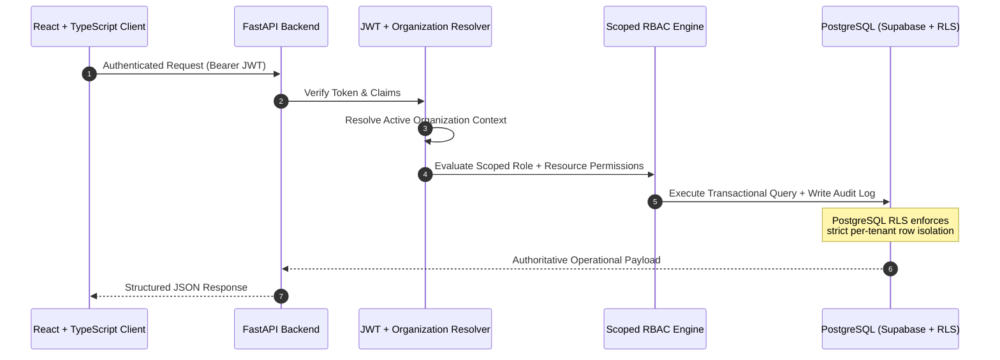
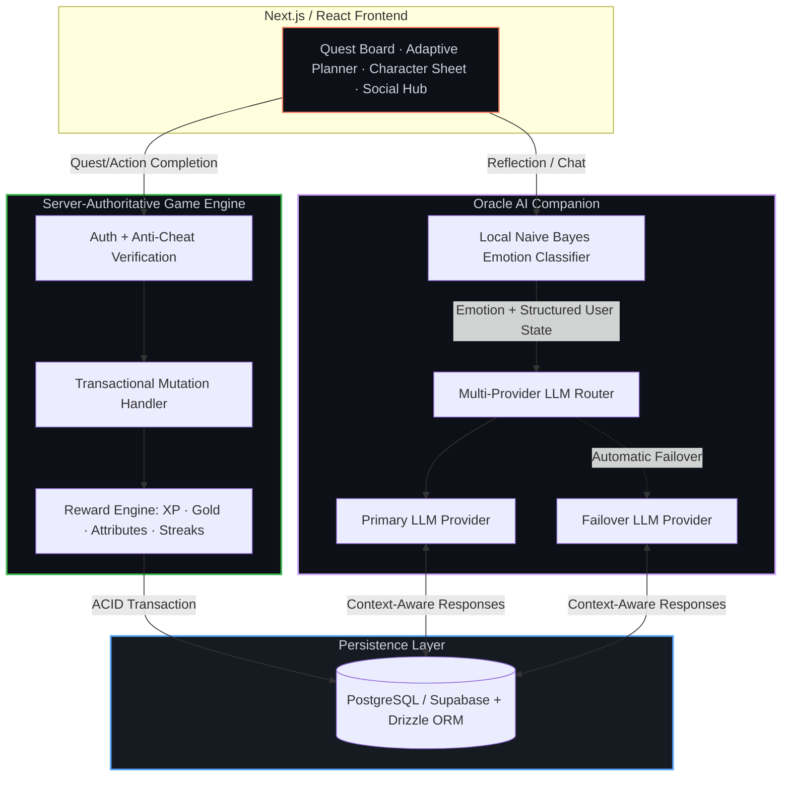
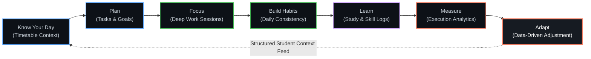
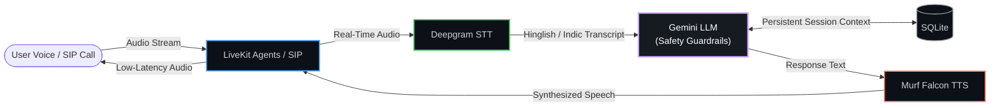
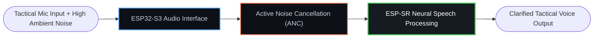
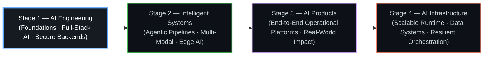

```markdown
<div align="center">

<!-- HERO BACKGROUND ANIMATION -->
<svg width="100%" height="180" xmlns="http://www.w3.org/2000/svg">
  <defs>
    <linearGradient id="heroGrad" x1="0%" y1="0%" x2="100%" y2="100%">
      <stop offset="0%" stop-color="#0D1117" />
      <stop offset="50%" stop-color="#161B22" />
      <stop offset="100%" stop-color="#0D1117" />
    </linearGradient>
    <radialGradient id="glow1" cx="20%" cy="30%" r="60%">
      <stop offset="0%" stop-color="#58A6FF" stop-opacity="0.15" />
      <stop offset="100%" stop-color="#58A6FF" stop-opacity="0" />
    </radialGradient>
    <radialGradient id="glow2" cx="80%" cy="20%" r="50%">
      <stop offset="0%" stop-color="#D2A8FF" stop-opacity="0.12" />
      <stop offset="100%" stop-color="#D2A8FF" stop-opacity="0" />
    </radialGradient>
    <radialGradient id="glow3" cx="50%" cy="90%" r="40%">
      <stop offset="0%" stop-color="#3FB950" stop-opacity="0.10" />
      <stop offset="100%" stop-color="#3FB950" stop-opacity="0" />
    </radialGradient>
    <filter id="blur">
      <feGaussianBlur stdDeviation="40" />
    </filter>
  </defs>
  <rect width="100%" height="180" fill="url(#heroGrad)" />
  <circle cx="15%" cy="40%" r="180" fill="url(#glow1)" filter="url(#blur)" />
  <circle cx="85%" cy="20%" r="150" fill="url(#glow2)" filter="url(#blur)" />
  <circle cx="50%" cy="120%" r="140" fill="url(#glow3)" filter="url(#blur)" />
</svg>

<br>

# Kunal Choudhary

<h3>
  <span style="color:#C9D1D9;font-weight:600;">AI Engineer in Progress</span> 
  <span style="color:#8B949E;">·</span> 
  <span style="color:#58A6FF;font-weight:600;">AI Builder</span> 
  <span style="color:#8B949E;">·</span> 
  <span style="color:#D2A8FF;font-weight:600;">Backend & Intelligent Systems</span>
</h3>

<div style="height:6px;"></div>

<pre style="background:#0D1117;border:1px solid #30363D;border-radius:14px;padding:14px 18px;margin:10px auto 0 auto;max-width:820px;box-shadow:0 0 40px -20px #58A6FF inset,0 10px 60px -30px #58A6FF;">
<code style="font-size:14px;line-height:1.8;color:#C9D1D9;white-space:pre-wrap;">I build intelligent systems that connect AI, software engineering,
data, automation and real-world workflows.
2nd-Year B.E. AI & Data Science (India) · Full-Stack AI · Secure Backends · Adaptive Platforms</code>
</pre>

<div style="height:14px;"></div>

<p align="center">
  <a href="#-engineering-philosophy">
    
  </a>
  <a href="#-featured-systems--projects">
    
  </a>
  <a href="#-technology-architecture">
    
  </a>
  <a href="#-mission-2030">
    
  </a>
</p>

<p align="center">
  <a href="https://github.com/kunalchwdry">
    
  </a>
  <a href="#">
    
  </a>
  <a href="#">
    
  </a>
</p>

</div>

<br>

## ⚡ Currently Building & Engineering Focus

<table>
<tr>
<td align="center" width="25%" style="background:#0D1117;border:1px solid #30363D;border-radius:16px;padding:20px 14px;transition:all 0.3s ease;box-shadow:0 10px 60px -30px #58A6FF;">
  <h3 style="margin:4px 0;color:#58A6FF;">LLM & Agentic</h3>
  <p style="color:#C9D1D9;font-size:13px;line-height:1.7;margin:8px 0 0 0;">Multi-provider routing · Auto-failover · Hybrid Local ML + LLM · Structured Context</p>
</td>
<td align="center" width="25%" style="background:#0D1117;border:1px solid #30363D;border-radius:16px;padding:20px 14px;transition:all 0.3s ease;box-shadow:0 10px 60px -30px #D2A8FF;">
  <h3 style="margin:4px 0;color:#D2A8FF;">Voice & Edge AI</h3>
  <p style="color:#C9D1D9;font-size:13px;line-height:1.7;margin:8px 0 0 0;">Real-time STT→LLM→TTS · SIP Telephony · ESP-SR · Neural Audio & ANC</p>
</td>
<td align="center" width="25%" style="background:#0D1117;border:1px solid #30363D;border-radius:16px;padding:20px 14px;transition:all 0.3s ease;box-shadow:0 10px 60px -30px #3FB950;">
  <h3 style="margin:4px 0;color:#3FB950;">Backend & Security</h3>
  <p style="color:#C9D1D9;font-size:13px;line-height:1.7;margin:8px 0 0 0;">Multi-Tenant SaaS · JWT · Scoped RBAC · PostgreSQL RLS · Transactional Engines</p>
</td>
<td align="center" width="25%" style="background:#0D1117;border:1px solid #30363D;border-radius:16px;padding:20px 14px;transition:all 0.3s ease;box-shadow:0 10px 60px -30px #F78166;">
  <h3 style="margin:4px 0;color:#F78166;">Data & Adaptive</h3>
  <p style="color:#C9D1D9;font-size:13px;line-height:1.7;margin:8px 0 0 0;">Feedback Loops · Server-Authoritative Gamification · Habits/Focus Analytics · Structured Data</p>
</td>
</tr>
</table>

<div align="center" style="margin-top:10px;">
<sub style="color:#8B949E;">Core Focus — Engineered for deterministic intelligence, not just probabilistic responses.</sub>
</div>

<br>

## 🧠 Engineering Philosophy

```mermaid
flowchart LR
    A["Problem"] --> B["System Design"]
    B --> C["Data Schema"]
    C --> D["Secure Backend"]
    D --> E["AI / Intelligence"]
    E --> F["User Experience"]
    F --> G["Measure"]
    G --> H["Iterate"]
    H -.->|"Continuous Feedback Loop"| B

    style A fill:#0D1117,stroke:#58A6FF,stroke-width:2px,color:#FFFFFF
    style B fill:#0D1117,stroke:#58A6FF,stroke-width:2px,color:#C9D1D9
    style C fill:#0D1117,stroke:#3FB950,stroke-width:2px,color:#C9D1D9
    style D fill:#0D1117,stroke:#3FB950,stroke-width:2px,color:#C9D1D9
    style E fill:#161B22,stroke:#D2A8FF,stroke-width:2.5px,color:#FFFFFF
    style F fill:#0D1117,stroke:#F78166,stroke-width:2px,color:#C9D1D9
    style G fill:#0D1117,stroke:#F78166,stroke-width:2px,color:#C9D1D9
    style H fill:#0D1117,stroke:#58A6FF,stroke-width:2px,color:#FFFFFF
```

<div align="center" style="background:#0D1117;border:1px solid #30363D;border-radius:20px;padding:26px 20px 10px 20px;box-shadow:0 20px 80px -40px #58A6FF;">



</div>

<details>
<summary style="cursor:pointer;list-style:none;">
  <div align="center" style="background:linear-gradient(90deg,#161B22 0%,#0D1117 100%);border:1px solid #30363D;border-radius:14px;padding:12px 16px;margin-top:16px;max-width:420px;margin-left:auto;margin-right:auto;box-shadow:0 10px 60px -30px #58A6FF;">
    <strong style="color:#58A6FF;">▾ Click to Expand: Core Architectural Principles</strong>
  </div>
</summary>

<br>

<table>
<tr>
<td width="50%" valign="top" style="background:#0D1117;border:1px solid #30363D;border-radius:14px;padding:18px;">
  <h4 style="color:#3FB950;margin:0 0 8px 0;">1. Server-Authoritative State</h4>
  <p style="color:#C9D1D9;font-size:14px;line-height:1.8;margin:0;">All critical mutations, permissions, and reward calculations are enforced server-side inside ACID transactions. Client input is treated as untrusted. <em style="color:#8B949E;">(TRAXIS · Questbound)</em></p>
</td>
<td width="50%" valign="top" style="background:#0D1117;border:1px solid #30363D;border-radius:14px;padding:18px;">
  <h4 style="color:#58A6FF;margin:0 0 8px 0;">2. Defense-in-Depth Security</h4>
  <p style="color:#C9D1D9;font-size:14px;line-height:1.8;margin:0;">API-level JWT validation + Scoped RBAC combined with database-level PostgreSQL Row-Level Security (RLS), tenant isolation and immutable audit logging. <em style="color:#8B949E;">(TRAXIS)</em></p>
</td>
</tr>
<tr>
<td width="50%" valign="top" style="background:#0D1117;border:1px solid #30363D;border-radius:14px;padding:18px;">
  <h4 style="color:#D2A8FF;margin:0 0 8px 0;">3. Resilient AI Pipelines</h4>
  <p style="color:#C9D1D9;font-size:14px;line-height:1.8;margin:0;">Fault-tolerant multi-provider LLM routing with automatic failover, complemented by lightweight on-device/local classifiers to reduce single-point failure risk. <em style="color:#8B949E;">(Questbound)</em></p>
</td>
<td width="50%" valign="top" style="background:#0D1117;border:1px solid #30363D;border-radius:14px;padding:18px;">
  <h4 style="color:#F78166;margin:0 0 8px 0;">4. Structured Context Before Intelligence</h4>
  <p style="color:#C9D1D9;font-size:14px;line-height:1.8;margin:0;">Clean normalized schemas capture operational/behavioral context first, enabling AI to reason over structured signals instead of unstructured noise. <em style="color:#8B949E;">(InnerLoop · Questbound)</em></p>
</td>
</tr>
</table>

</details>

<br>

## 🚀 Featured Systems & Projects

<div align="center">
  <p style="color:#8B949E;margin:0 0 10px 0;">Each system below is engineered with security, determinism and extensibility as first-class constraints.</p>
</div>

<!-- PROJECT 1: TRAXIS -->
<details open>
<summary style="cursor:pointer;list-style:none;">
  <div style="background:radial-gradient(120% 120% at 50% 0%,#0F1A2B 0%,#0D1117 70%);border:1px solid #1F6FEB;border-radius:18px;padding:18px 22px;margin-bottom:14px;box-shadow:0 20px 90px -40px #58A6FF;">
    <h3 style="margin:0;color:#FFFFFF;">1. <a href="https://github.com/kunalchwdry/Traxis" style="color:#58A6FF;text-decoration:none;">TRAXIS</a> — Integrated Polar Expedition Logistics & Asset Management System</h3>
    <p style="margin:6px 0 0 0;color:#C9D1D9;">Smart India Hackathon 2026 · Problem Statement 26062 · MoES / NCPOR</p>
  </div>
</summary>

<br>

<div style="background:#0D1117;border:1px solid #30363D;border-radius:18px;padding:24px 24px 6px 24px;box-shadow:0 20px 80px -40px #58A6FF;">

<table>
<tr>
<td width="40%" valign="top">
  <div style="background:#161B22;border:1px solid #30363D;border-radius:14px;padding:16px 18px;height:100%;">
    <h4 style="color:#58A6FF;margin:0 0 8px 0;">System Purpose</h4>
    <p style="color:#C9D1D9;font-size:14px;line-height:1.9;margin:0;">Multi-tenant operational platform engineered for high-stakes polar expeditions—coordinating expedition lifecycles, personnel, cargo, assets, inventory, incident reporting and organization-scoped access workflows.</p>
    <br>
    <h4 style="color:#3FB950;margin:0 0 8px 0;">Tech Stack</h4>
    <p style="color:#C9D1D9;font-size:13px;line-height:2;margin:0;">`React` · `Vite` · `TypeScript` · `FastAPI` · `PostgreSQL` · `Supabase` · `JWT` · `RBAC` · `RLS`</p>
  </div>
</td>
<td width="60%" valign="top">
  <div style="background:#161B22;border:1px solid #30363D;border-radius:14px;padding:16px 18px;height:100%;">
    <h4 style="color:#D2A8FF;margin:0 0 8px 0;">Engineering Highlights</h4>
    <ul style="color:#C9D1D9;font-size:14px;line-height:1.9;margin:4px 0 0 18px;padding:0;">
      <li><strong>Server-Authoritative Request Lifecycle:</strong> <code style="background:#0D1117;padding:2px 6px;border-radius:8px;border:1px solid #30363D;">React → API → JWT Verification → Organization Resolution → RBAC → Database (RLS) → Response</code></li>
      <li><strong>Defense-in-Depth:</strong> Scoped RBAC, PostgreSQL Row-Level Security (RLS), tenant isolation, comprehensive audit logging and backend integration testing.</li>
      <li><strong>Operational Modeling:</strong> Engineered for mission-critical logistics with deterministic authorization enforced at both API and database layers.</li>
    </ul>
  </div>
</td>
</tr>
</table>

<br>

<div align="center">

</div>

<br>

</div>
</details>

<br>

<!-- PROJECT 2: QUESTBOUND -->
<details>
<summary style="cursor:pointer;list-style:none;">
  <div style="background:radial-gradient(120% 120% at 50% 0%,#1A102B 0%,#0D1117 70%);border:1px solid #8957E5;border-radius:18px;padding:18px 22px;margin-bottom:14px;box-shadow:0 20px 90px -40px #D2A8FF;">
    <h3 style="margin:0;color:#FFFFFF;">2. <a href="https://github.com/kunalchwdry/Questbound" style="color:#D2A8FF;text-decoration:none;">Questbound</a> — Gamified Adaptive Productivity Platform (Life RPG)</h3>
    <p style="margin:6px 0 0 0;color:#C9D1D9;">Turns real-world execution into a server-authoritative adaptive RPG system.</p>
  </div>
</summary>

<br>

<div style="background:#0D1117;border:1px solid #30363D;border-radius:18px;padding:24px 24px 6px 24px;box-shadow:0 20px 80px -40px #D2A8FF;">

<table>
<tr>
<td width="40%" valign="top">
  <div style="background:#161B22;border:1px solid #30363D;border-radius:14px;padding:16px 18px;height:100%;">
    <h4 style="color:#D2A8FF;margin:0 0 8px 0;">System Purpose</h4>
    <p style="color:#C9D1D9;font-size:14px;line-height:1.9;margin:0;">Full-stack productivity RPG where tasks become quests, driving deterministic character progression, adaptive planning, streaks, attributes, community features and an emotionally-aware AI companion (<strong>Oracle</strong>).</p>
    <br>
    <h4 style="color:#3FB950;margin:0 0 8px 0;">Tech Stack</h4>
    <p style="color:#C9D1D9;font-size:13px;line-height:2;margin:0;">`Next.js` · `React` · `TypeScript` · `PostgreSQL` · `Supabase` · `Drizzle ORM` · `Naive Bayes` · `Multi-Provider LLMs`</p>
  </div>
</td>
<td width="60%" valign="top">
  <div style="background:#161B22;border:1px solid #30363D;border-radius:14px;padding:16px 18px;height:100%;">
    <h4 style="color:#58A6FF;margin:0 0 8px 0;">Engineering Highlights</h4>
    <ul style="color:#C9D1D9;font-size:14px;line-height:1.9;margin:4px 0 0 18px;padding:0;">
      <li><strong>Server-Side Transactional Game Engine:</strong> XP, Gold, Attribute Progression, Streaks and quest completions computed server-authoritatively with anti-cheat/authorization principles inside ACID transactions.</li>
      <li><strong>Hybrid AI Companion (Oracle):</strong> Local <strong>Naive Bayes Emotion Classification</strong> → Context-Enriched Routing → <strong>Multi-Provider LLM Architecture</strong> with <strong>Automatic Failover</strong> for resilience.</li>
      <li><strong>Deterministic Progression:</strong> Reward curves and multipliers enforced on the backend to prevent client-side manipulation.</li>
    </ul>
  </div>
</td>
</tr>
</table>

<br>

<div align="center">

</div>

<br>

</div>
</details>

<br>

<!-- PROJECT 3: INNERLOOP -->
<details>
<summary style="cursor:pointer;list-style:none;">
  <div style="background:radial-gradient(120% 120% at 50% 0%,#102226 0%,#0D1117 70%);border:1px solid #3FB950;border-radius:18px;padding:18px 22px;margin-bottom:14px;box-shadow:0 20px 90px -40px #3FB950;">
    <h3 style="margin:0;color:#FFFFFF;">3. InnerLoop — Student Productivity & Continuous-Improvement Platform</h3>
    <p style="margin:6px 0 0 0;color:#C9D1D9;">Structured academic workflows · Adaptive planning · AI-ready data architecture</p>
  </div>
</summary>

<br>

<div style="background:#0D1117;border:1px solid #30363D;border-radius:18px;padding:24px 24px 6px 24px;box-shadow:0 20px 80px -40px #3FB950;">

<table>
<tr>
<td width="40%" valign="top">
  <div style="background:#161B22;border:1px solid #30363D;border-radius:14px;padding:16px 18px;height:100%;">
    <h4 style="color:#3FB950;margin:0 0 8px 0;">System Purpose</h4>
    <p style="color:#C9D1D9;font-size:14px;line-height:1.9;margin:0;">Unified student operating system that connects timetable reality with goals, habits, focus, learning and measurable execution—closing the loop between daily effort and long-term improvement.</p>
    <br>
    <h4 style="color:#58A6FF;margin:0 0 8px 0;">Tech Stack</h4>
    <p style="color:#C9D1D9;font-size:13px;line-height:2;margin:0;">`React` · `Vite` · `Tailwind CSS` · `Supabase` · `PostgreSQL`</p>
    <div style="margin-top:10px;background:#0F2614;border:1px solid #238636;border-radius:12px;padding:8px 10px;">
      <p style="color:#3FB950;font-size:12px;line-height:1.6;margin:0;"><strong>Status Note:</strong> Structured data foundation implemented. <strong>Full AI reasoning & context synthesis layer</strong> is currently on the <strong>roadmap</strong> (not claimed as implemented).</p>
    </div>
  </div>
</td>
<td width="60%" valign="top">
  <div style="background:#161B22;border:1px solid #30363D;border-radius:14px;padding:16px 18px;height:100%;">
    <h4 style="color:#D2A8FF;margin:0 0 8px 0;">Engineering Highlights</h4>
    <ul style="color:#C9D1D9;font-size:14px;line-height:1.9;margin:4px 0 0 18px;padding:0;">
      <li><strong>Structured Student Context Schema:</strong> Normalizes timetable, tasks, goals, habits, focus sessions, learning logs and analytics into a unified relational model for adaptive planning.</li>
      <li><strong>AI-Ready Data Platform:</strong> Architected to feed future intelligence with clean, queryable execution signals (separating <em>implemented foundation</em> from <em>planned AI reasoning layer</em>).</li>
      <li><strong>Closed Feedback Loop Design:</strong> Measures → Adapts → Re-plans based on captured behavioral signals.</li>
    </ul>
  </div>
</td>
</tr>
</table>

<br>

<div align="center">

</div>

<br>

</div>
</details>

<br>

<!-- PROJECT 4: ANAYA -->
<details>
<summary style="cursor:pointer;list-style:none;">
  <div style="background:radial-gradient(120% 120% at 50% 0%,#1F1A0F 0%,#0D1117 70%);border:1px solid #F78166;border-radius:18px;padding:18px 22px;margin-bottom:14px;box-shadow:0 20px 90px -40px #F78166;">
    <h3 style="margin:0;color:#FFFFFF;">4. <a href="https://github.com/kunalchwdry/anaya-health-assistant" style="color:#F78166;text-decoration:none;">Anaya Health Assistant</a> — Multilingual Voice AI for Healthcare Access</h3>
    <p style="margin:6px 0 0 0;color:#C9D1D9;">Low-latency real-time voice AI · Hinglish & Indian-language accessibility · Safety-first design</p>
  </div>
</summary>

<br>

<div style="background:#0D1117;border:1px solid #30363D;border-radius:18px;padding:24px 24px 6px 24px;box-shadow:0 20px 80px -40px #F78166;">

<table>
<tr>
<td width="40%" valign="top">
  <div style="background:#161B22;border:1px solid #30363D;border-radius:14px;padding:16px 18px;height:100%;">
    <h4 style="color:#F78166;margin:0 0 8px 0;">System Purpose</h4>
    <p style="color:#C9D1D9;font-size:14px;line-height:1.9;margin:0;">End-to-end real-time conversational voice agent designed for accessible health navigation with persistent session state and low-latency streaming orchestration.</p>
    <br>
    <h4 style="color:#3FB950;margin:0 0 8px 0;">Tech Stack</h4>
    <p style="color:#C9D1D9;font-size:13px;line-height:2;margin:0;">`Python` · `LiveKit Agents / SIP` · `Deepgram` · `Gemini API` · `Murf Falcon` · `SQLite`</p>
  </div>
</td>
<td width="60%" valign="top">
  <div style="background:#161B22;border:1px solid #30363D;border-radius:14px;padding:16px 18px;height:100%;">
    <h4 style="color:#D2A8FF;margin:0 0 8px 0;">Engineering Highlights</h4>
    <ul style="color:#C9D1D9;font-size:14px;line-height:1.9;margin:4px 0 0 18px;padding:0;">
      <li><strong>Real-Time Streaming Pipeline:</strong> Integrated STT, LLM reasoning and TTS into a low-latency conversational loop with persistent session context.</li>
      <li><strong>Multilingual Accessibility:</strong> Optimized for <strong>Hinglish</strong> and Indian-language conversational flows over real-time voice streams and telephony interfaces.</li>
      <li><strong>Safety-First Guardrails:</strong> Strictly scoped around a <strong>non-diagnostic, non-prescriptive assistant design</strong> to enforce safe healthcare navigation boundaries.</li>
    </ul>
  </div>
</td>
</tr>
</table>

<br>

<div align="center">

</div>

<br>

</div>
</details>

<br>

<!-- PROJECT 5: SHIELD-COM -->
<details>
<summary style="cursor:pointer;list-style:none;">
  <div style="background:radial-gradient(120% 120% at 50% 0%,#101826 0%,#0D1117 70%);border:1px solid #58A6FF;border-radius:18px;padding:18px 22px;margin-bottom:14px;box-shadow:0 20px 90px -40px #58A6FF;">
    <h3 style="margin:0;color:#FFFFFF;">5. SHIELD-COM — Tactical Edge AI & Embedded Speech Processing</h3>
    <p style="margin:6px 0 0 0;color:#C9D1D9;">Edge AI · Embedded Systems · Neural Speech Enhancement for high-noise environments</p>
  </div>
</summary>

<br>

<div style="background:#0D1117;border:1px solid #30363D;border-radius:18px;padding:24px 24px 6px 24px;box-shadow:0 20px 80px -40px #58A6FF;">

<table>
<tr>
<td width="40%" valign="top">
  <div style="background:#161B22;border:1px solid #30363D;border-radius:14px;padding:16px 18px;height:100%;">
    <h4 style="color:#58A6FF;margin:0 0 8px 0;">System Purpose</h4>
    <p style="color:#C9D1D9;font-size:14px;line-height:1.9;margin:0;">Embedded voice processing prototype focused on speech clarity in high-noise tactical/operational communication environments with tight hardware-software coupling.</p>
    <br>
    <h4 style="color:#3FB950;margin:0 0 8px 0;">Tech Stack</h4>
    <p style="color:#C9D1D9;font-size:13px;line-height:2;margin:0;">`ESP32-S3` · `ESP-SR` · `Embedded C/C++` · `Active Noise Cancellation (ANC)` · `Neural Speech Processing`</p>
  </div>
</td>
<td width="60%" valign="top">
  <div style="background:#161B22;border:1px solid #30363D;border-radius:14px;padding:16px 18px;height:100%;">
    <h4 style="color:#D2A8FF;margin:0 0 8px 0;">Engineering Highlights</h4>
    <ul style="color:#C9D1D9;font-size:14px;line-height:1.9;margin:4px 0 0 18px;padding:0;">
      <li><strong>Edge-Native Audio Intelligence:</strong> Integrated <strong>Active Noise Cancellation (ANC)</strong> with <strong>Neural Speech Processing</strong> directly on resource-constrained edge hardware.</li>
      <li><strong>Hardware–Software Co-Design:</strong> Leveraged the <strong>ESP-SR</strong> framework on <strong>ESP32-S3</strong> to enable low-latency, on-device speech enhancement.</li>
      <li><strong>Real-Time Signal Processing:</strong> Focused on acoustic denoising and intelligibility preservation for edge-deployed voice pipelines.</li>
    </ul>
  </div>
</td>
</tr>
</table>

<br>

<div align="center">

</div>

<br>

</div>
</details>

<br>

<!-- PROJECT 6: NOLIMI -->
<details>
<summary style="cursor:pointer;list-style:none;">
  <div style="background:radial-gradient(120% 120% at 50% 0%,#141826 0%,#0D1117 70%);border:1px solid #8957E5;border-radius:18px;padding:18px 22px;margin-bottom:14px;box-shadow:0 20px 90px -40px #D2A8FF;">
    <h3 style="margin:0;color:#FFFFFF;">6. NoLimi — Personal AI Desktop Assistant</h3>
    <p style="margin:6px 0 0 0;color:#C9D1D9;">Natural-language control · Desktop Automation · Local System Execution</p>
  </div>
</summary>

<br>

<div style="background:#0D1117;border:1px solid #30363D;border-radius:18px;padding:24px;">
  <table>
  <tr>
  <td width="40%" valign="top">
    <div style="background:#161B22;border:1px solid #30363D;border-radius:14px;padding:16px 18px;height:100%;">
      <h4 style="color:#D2A8FF;margin:0 0 8px 0;">System Purpose</h4>
      <p style="color:#C9D1D9;font-size:14px;line-height:1.9;margin:0;">Voice- and text-driven desktop assistant that maps natural-language intent to local OS, application and browser actions—bridging LLM reasoning with executable system control.</p>
      <br>
      <h4 style="color:#3FB950;margin:0 0 8px 0;">Tech Stack</h4>
      <p style="color:#C9D1D9;font-size:13px;line-height:2;margin:0;">`Python` · `Gemini API` · `Speech Recognition` · `Text-to-Speech (TTS)` · `Browser & OS Automation`</p>
    </div>
  </td>
  <td width="60%" valign="top">
    <div style="background:#161B22;border:1px solid #30363D;border-radius:14px;padding:16px 18px;height:100%;">
      <h4 style="color:#58A6FF;margin:0 0 8px 0;">Engineering Highlights</h4>
      <ul style="color:#C9D1D9;font-size:14px;line-height:1.9;margin:4px 0 0 18px;padding:0;">
        <li><strong>Intent → Action Mapping:</strong> Connected Speech Recognition, TTS and Gemini API to local execution routines for safe, natural-language desktop control.</li>
        <li><strong>Pragmatic Automation:</strong> Designed for application launching, browser automation and local system controls with a focus on reliability and deterministic execution paths.</li>
        <li><strong>Extensible Roadmap:</strong> Evolving toward a broader direction combining <strong>AI + Desktop Automation + Cybersecurity</strong> workflows <em>(roadmap-oriented expansion)</em>.</li>
      </ul>
    </div>
  </td>
  </tr>
  </table>
</div>
</details>

<br>

<!-- PROJECT 7: DATAVORTEX -->
<details>
<summary style="cursor:pointer;list-style:none;">
  <div style="background:radial-gradient(120% 120% at 50% 0%,#0F1F1A 0%,#0D1117 70%);border:1px solid #3FB950;border-radius:18px;padding:18px 22px;margin-bottom:14px;box-shadow:0 20px 90px -40px #3FB950;">
    <h3 style="margin:0;color:#FFFFFF;">7. DataVortex — Data & AI Systems Engineering</h3>
    <p style="margin:6px 0 0 0;color:#C9D1D9;">Structured Data Workflows · Analytical Architectures · Applied AI/Data Engineering</p>
  </div>
</summary>

<br>

<div style="background:#0D1117;border:1px solid #30363D;border-radius:18px;padding:24px;">
  <table>
  <tr>
  <td width="40%" valign="top">
    <div style="background:#161B22;border:1px solid #30363D;border-radius:14px;padding:16px 18px;height:100%;">
      <h4 style="color:#3FB950;margin:0 0 8px 0;">Focus Area</h4>
      <p style="color:#C9D1D9;font-size:14px;line-height:1.9;margin:0;">Explorations in data pipelines, analytical system design and AI-driven problem-solving—focused on transforming raw data into structured, actionable signals.</p>
      <br>
      <h4 style="color:#58A6FF;margin:0 0 8px 0;">Tech Stack</h4>
      <p style="color:#C9D1D9;font-size:13px;line-height:2;margin:0;">`Python` · `Data Systems` · `AI / ML Workflows`</p>
    </div>
  </td>
  <td width="60%" valign="top">
    <div style="background:#161B22;border:1px solid #30363D;border-radius:14px;padding:16px 18px;height:100%;">
      <h4 style="color:#D2A8FF;margin:0 0 8px 0;">Engineering Highlights</h4>
      <ul style="color:#C9D1D9;font-size:14px;line-height:1.9;margin:4px 0 0 18px;padding:0;">
        <li><strong>Structured Data Modeling:</strong> Designing clean, queryable schemas and transformation layers to ensure traceability and reproducibility.</li>
        <li><strong>Applied AI/Data Engineering:</strong> Focused on pattern extraction, signal structuring and decision-support-oriented data workflows.</li>
        <li><strong>Systems-First Thinking:</strong> Treating data pipelines as production-minded systems with clarity, consistency and maintainability.</li>
      </ul>
    </div>
  </td>
  </tr>
  </table>
</div>
</details>

<br>

## 🛠️ Technology Architecture

<div align="center" style="background:#0D1117;border:1px solid #30363D;border-radius:20px;padding:24px 20px;box-shadow:0 20px 80px -40px #D2A8FF;">

<table>
<tr>
<td valign="top" style="background:#161B22;border:1px solid #30363D;border-radius:14px;padding:16px 18px;">
  <h4 style="color:#D2A8FF;margin:0 0 10px 0;">🧠 AI, ML & Voice</h4>
  <p style="color:#C9D1D9;font-size:13px;line-height:2;margin:0;">`Python` · `PyTorch` · `OpenCV` · `Gemini API` · `Multi-Provider LLM Architectures` · `Naive Bayes` · `LiveKit Agents / SIP` · `Deepgram` · `Murf Falcon` · `ESP-SR` · `Neural Speech Processing`</p>
</td>
</tr>
<tr><td style="height:10px;"></td></tr>
<tr>
<td valign="top" style="background:#161B22;border:1px solid #30363D;border-radius:14px;padding:16px 18px;">
  <h4 style="color:#3FB950;margin:0 0 10px 0;">⚙️ Backend, Data & ORM</h4>
  <p style="color:#C9D1D9;font-size:13px;line-height:2;margin:0;">`FastAPI` · `Next.js (Server Actions/APIs)` · `PostgreSQL` · `Supabase` · `Drizzle ORM` · `SQLite` · `REST APIs` · `Transactional Data Models`</p>
</td>
</tr>
<tr><td style="height:10px;"></td></tr>
<tr>
<td valign="top" style="background:#161B22;border:1px solid #30363D;border-radius:14px;padding:16px 18px;">
  <h4 style="color:#58A6FF;margin:0 0 10px 0;">🔐 Security, Auth & Resiliency</h4>
  <p style="color:#C9D1D9;font-size:13px;line-height:2;margin:0;">`JWT Authentication` · `Scoped Role-Based Access Control (RBAC)` · `PostgreSQL Row-Level Security (RLS)` · `Audit Logging` · `Tenant Isolation` · `Server-Authoritative State` · `Multi-Provider Failover`</p>
</td>
</tr>
<tr><td style="height:10px;"></td></tr>
<tr>
<td valign="top" style="background:#161B22;border:1px solid #30363D;border-radius:14px;padding:16px 18px;">
  <h4 style="color:#F78166;margin:0 0 10px 0;">💻 Frontend & UX Engineering</h4>
  <p style="color:#C9D1D9;font-size:13px;line-height:2;margin:0;">`React` · `Next.js` · `TypeScript` · `Vite` · `Tailwind CSS` · `Component-Driven UI` · `Data-Driven Interfaces`</p>
</td>
</tr>
<tr><td style="height:10px;"></td></tr>
<tr>
<td valign="top" style="background:#161B22;border:1px solid #30363D;border-radius:14px;padding:16px 18px;">
  <h4 style="color:#8B949E;margin:0 0 10px 0;">🔌 Edge, Systems & Tooling</h4>
  <p style="color:#C9D1D9;font-size:13px;line-height:2;margin:0;">`ESP32-S3` · `ESP-SR` · `Embedded C/C++` · `Active Noise Cancellation (ANC)` · `Git` · `GitHub` · `Linux / Windows OS Automation`</p>
</td>
</tr>
</table>

</div>

<br>

## 🧩 What I Build & Engineering Interests

<table>
<tr>
<td width="50%" valign="top" style="background:#0D1117;border:1px solid #30363D;border-radius:16px;padding:20px 22px;">
  <h3 style="color:#3FB950;margin:0 0 12px 0;">🏗️ Systems I Like Building</h3>
  <ul style="color:#C9D1D9;font-size:14px;line-height:2;margin:0 0 0 18px;padding:0;">
    <li><strong>AI-Powered Applications & Agentic Workflows</strong> — Blending deterministic execution with LLM reasoning.</li>
    <li><strong>Secure, Multi-Tenant Backend Platforms</strong> — Built with RBAC, RLS, auditability and defense-in-depth.</li>
    <li><strong>Transactional & Adaptive Productivity Systems</strong> — Modeling human behavior through structured, measurable feedback loops.</li>
    <li><strong>Real-Time Voice AI & Telephony Pipelines</strong> — Low-latency, safety-aware conversational systems.</li>
    <li><strong>Edge AI & Hardware-Integrated Software</strong> — Tight co-design between silicon constraints and intelligence.</li>
    <li><strong>Intelligent Desktop Automation & Developer Tools</strong> — Translating natural language into reliable local execution.</li>
  </ul>
</td>
<td width="50%" valign="top" style="background:#0D1117;border:1px solid #30363D;border-radius:16px;padding:20px 22px;">
  <h3 style="color:#D2A8FF;margin:0 0 12px 0;">🔬 Core Engineering Interests</h3>
  <ul style="color:#C9D1D9;font-size:14px;line-height:2;margin:0 0 0 18px;padding:0;">
    <li><code style="background:#161B22;border:1px solid #30363D;border-radius:8px;padding:1px 6px;">Artificial Intelligence & Machine Learning</code></li>
    <li><code style="background:#161B22;border:1px solid #30363D;border-radius:8px;padding:1px 6px;">Generative AI · LLMs · Multi-Agent Architectures</code></li>
    <li><code style="background:#161B22;border:1px solid #30363D;border-radius:8px;padding:1px 6px;">Backend Systems & Database Architecture</code></li>
    <li><code style="background:#161B22;border:1px solid #30363D;border-radius:8px;padding:1px 6px;">Data Engineering & Structured Context Engineering</code></li>
    <li><code style="background:#161B22;border:1px solid #30363D;border-radius:8px;padding:1px 6px;">Computer Vision & Neural Speech Processing</code></li>
    <li><code style="background:#161B22;border:1px solid #30363D;border-radius:8px;padding:1px 6px;">Cybersecurity & Server-Authoritative Design</code></li>
    <li><code style="background:#161B22;border:1px solid #30363D;border-radius:8px;padding:1px 6px;">Scalable Distributed Systems & Developer Tooling</code></li>
  </ul>
</td>
</tr>
</table>

<br>

## 📚 Current Learning & Technical Growth

<div align="center" style="background:linear-gradient(180deg,#0D1117 0%,#161B22 100%);border:1px solid #30363D;border-radius:20px;padding:24px 24px 10px 24px;box-shadow:0 20px 80px -40px #58A6FF;">

<h4 style="color:#58A6FF;margin:0 0 6px 0;">Execution Loop</h4>
<pre style="background:#0D1117;border:1px solid #30363D;border-radius:12px;padding:10px 14px;display:inline-block;margin:4px auto 14px auto;"><code style="color:#C9D1D9;">building → learning → experimenting → shipping</code></pre>

<table>
<tr>
<td width="33%" valign="top" style="background:#0D1117;border:1px solid #30363D;border-radius:14px;padding:16px 18px;">
  <h4 style="color:#3FB950;margin:0 0 8px 0;">AI/ML Fundamentals & Model Training</h4>
  <p style="color:#C9D1D9;font-size:14px;line-height:1.9;margin:0;">Strengthening core ML math, classical ML, Deep Learning workflows with <strong>PyTorch</strong> and applied <strong>OpenCV</strong> for vision-centric systems.</p>
</td>
<td width="33%" valign="top" style="background:#0D1117;border:1px solid #30363D;border-radius:14px;padding:16px 18px;">
  <h4 style="color:#D2A8FF;margin:0 0 8px 0;">LLM Systems, RAG & Agents</h4>
  <p style="color:#C9D1D9;font-size:14px;line-height:1.9;margin:0;">Deep-diving into <strong>Retrieval-Augmented Generation (RAG)</strong>, structured context engineering, evaluation frameworks and fault-tolerant <strong>multi-agent orchestration</strong>.</p>
</td>
<td width="33%" valign="top" style="background:#0D1117;border:1px solid #30363D;border-radius:14px;padding:16px 18px;">
  <h4 style="color:#58A6FF;margin:0 0 8px 0;">Backend & System Design</h4>
  <p style="color:#C9D1D9;font-size:14px;line-height:1.9;margin:0;">Advancing in database concurrency, transactional integrity, indexing strategies, distributed systems concepts and scalable, production-grade API architectures.</p>
</td>
</tr>
</table>

</div>

<br>

## 🎯 Mission 2030

<div align="center" style="background:#0D1117;border:1px solid #30363D;border-radius:20px;padding:26px 22px 16px 22px;box-shadow:0 20px 90px -40px #F78166;">

<div style="margin-bottom:18px;">
```text
AI Engineering → Intelligent Systems → AI Products → AI Infrastructure
```
</div>

<div style="background:#161B22;border:1px solid #30363D;border-radius:14px;padding:14px 18px;max-width:860px;margin:0 auto;box-shadow:0 10px 60px -30px #F78166;">
  <blockquote style="color:#C9D1D9;font-size:15px;line-height:1.9;margin:0;font-style:normal;">
    <strong>Mission 2030:</strong> Build deep technical foundations, ship increasingly complex AI systems, and grow into an engineer capable of designing intelligent systems end-to-end — from secure backends and structured data, to agentic intelligence and scalable AI infrastructure.
  </blockquote>
</div>

<br>



</div>

<br>

## 📊 GitHub Activity & Live Stats

<div align="center" style="background:#0D1117;border:1px solid #30363D;border-radius:20px;padding:24px 18px 10px 18px;box-shadow:0 20px 80px -40px #58A6FF;">

<p align="center">
  
  
</p>

<details>
<summary style="cursor:pointer;list-style:none;">
  <div align="center" style="background:linear-gradient(90deg,#161B22 0%,#0D1117 100%);border:1px solid #30363D;border-radius:14px;padding:10px 14px;margin:14px auto 0 auto;max-width:320px;">
    <strong style="color:#58A6FF;">▾ Expand: Top Languages & Contribution Graph</strong>
  </div>
</summary>

<br>

<p align="center">
  
</p>

<p align="center">
  
</p>

</details>

<div align="center" style="margin-top:10px;">
  <sub style="color:#8B949E;">Live GitHub telemetry — tracking consistent technical momentum over time.</sub>
</div>

</div>

<br>

## 🤝 Connect

<div align="center" style="background:#0D1117;border:1px solid #30363D;border-radius:16px;padding:16px 18px;max-width:520px;margin:0 auto;box-shadow:0 10px 60px -30px #58A6FF;">

<p align="center" style="margin:0;line-height:2;">
  <strong style="color:#C9D1D9;">GitHub:</strong> <a href="https://github.com/kunalchwdry" style="color:#58A6FF;text-decoration:none;"><strong>github.com/kunalchwdry</strong></a><br>
  <strong style="color:#C9D1D9;">LinkedIn:</strong> <span style="color:#8B949E;">*(Add LinkedIn URL)*</span><br>
  <strong style="color:#C9D1D9;">Email:</strong> <span style="color:#8B949E;">*(Add Email Address)*</span>
</p>

</div>

<br>

<div align="center">
  <svg width="100%" height="40" xmlns="http://www.w3.org/2000/svg">
    <defs>
      <linearGradient id="footerLine" x1="0%" y1="0%" x2="100%" y2="0%">
        <stop offset="0%" stop-color="#0D1117" stop-opacity="0" />
        <stop offset="50%" stop-color="#30363D" />
        <stop offset="100%" stop-color="#0D1117" stop-opacity="0" />
      </linearGradient>
    </defs>
    <rect y="19" width="100%" height="1" fill="url(#footerLine)" />
  </svg>
  <sub style="color:#8B949E;">Engineered with precision · Built for scale · Driven by Mission 2030.</sub>
</div>
```
