<div align="center">

<a href="https://readme-typing-svg.demolab.com">

</a>

<br/>

[](https://github.com/kunalchwdry)
[](https://www.linkedin.com/in/kunal-choudhary-918270425/)
[](https://github.com/kunalchwdry/Questbound)


### AI engineer in progress. Systems thinker by habit. Builder by default.

**I build systems where AI meets real software engineering** — from secure APIs and data pipelines to voice-first applications and adaptive products.

*BE Artificial Intelligence & Data Science · India · Mission 2030*

</div>


<a href="#"></a>

```text
┌──(kunal㉿forge-x)-[~/mission-2030]
└─$ ./status --verbose

  IDENTITY      AI ENGINEER IN PROGRESS
  SPECIALTY     Intelligent systems · Backend · Applied AI
  PRINCIPLE     Foundations first. Validate before you claim.
  LOOP          BUILD → MEASURE → LEARN → SHIP → REPEAT
  FINAL BOSS    AI INFRASTRUCTURE [NOT DEFEATED]
```


<table>
<tr>
<td width="60%" valign="top">

I'm a second-year BE AI & Data Science student focused on building the engineering foundations behind useful AI products.

My work spans **LLM applications, voice AI, backend architecture, data science, automation, and embedded speech systems**. I care about what happens underneath the demo: authorization, data quality, failure states, reproducibility, and whether a claim can actually be verified.

Right now, I'm building and hardening projects that turn messy real-world workflows into systems with clear rules, traceable data, and measurable outcomes.

**Current north star:** AI Engineering → Intelligent Systems → AI Products → AI Infrastructure.

</td>
<td width="40%" valign="top">

```yaml
player: Kunal Choudhary
class: AI Engineer
level: 02 → 99
guild: Forge-X
quest: Mission 2030

loadout:
  backend: FastAPI / Next.js
  data: PostgreSQL / Supabase
  intelligence: LLMs / NLP
  voice: STT → LLM → TTS
  mindset: ship_and_verify

boss:
  name: AI Infrastructure
  status: ACTIVE
```

</td>
</tr>
</table>


| Mission | What I'm working on |
| --- | --- |
| **FlowCare** | Provenance-first hospital discovery and outpatient coordination, with patient and hospital workflows |
| **TRAXIS** | Multi-tenant polar expedition logistics, assets, inventory, and operational access control |
| **Questbound** | Adaptive productivity RPG with server-authoritative progression and an AI companion |
| **DataVortex** | Reproducible, three-round data science pipeline: restoration → NLP → live signal tracking |
| **Learning track** | ML foundations, PyTorch, evaluation, RAG, agentic systems, and reliable backend design |

> **Operating principle:** a feature is not finished because it works once. It is finished when its behavior, boundaries, and failure modes are understood.


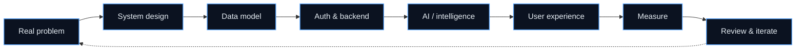

- **Foundations before features.** Data models, server-side validation, and access control come before AI glitter.
- **The server owns critical state.** Permissions, rewards, and important transitions are never trusted to the browser.
- **Structured context beats prompt chaos.** Useful intelligence depends on well-modeled inputs and explicit constraints.
- **Failures are part of the product.** Loading, empty, unauthorized, stale, and error states deserve deliberate behavior.
- **Evidence over impressive numbers.** Metrics need a reproducible method, a clear denominator, and honest limitations.
- **AI is a component, not the architecture.** The surrounding system determines whether intelligence is safe and useful.


## ◈ FlowCare


[](https://github.com/kunalchwdry/FlowCare)
[](https://flowcare-five.vercel.app)


FlowCare treats hospital discovery as a **data provenance and trust problem**, not merely a directory problem. Claims should have a source, verifier, and freshness context; when certainty is missing, the system should expose the uncertainty rather than manufacture confidence.

**Stack:** Next.js 15 · TypeScript · Tailwind CSS · Supabase · PostgreSQL · RLS · Zod · Vitest · Vercel

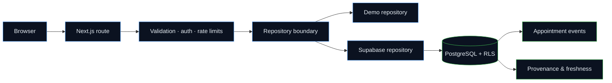

**What it explores**
- Hospital discovery by locality, specialty, service, and plain-language intent.
- Appointment request and confirmation workflows with server-authoritative data.
- Hospital-side operational views scoped to staff membership and appointment relationships.
- Appointment-derived waiting and consultation signals, with explicit stale/unavailable states.
- Patient visit history and reliability outcomes based on official appointment events.
- AI-assisted search intent extraction without allowing the model to write SQL or confirm bookings.

**Engineering focus**
- PostgreSQL Row Level Security and relationship-scoped access.
- Validated, version-aware appointment transitions and idempotent event handling.
- Clear separation between demo data and live database paths.
- Explicit error states rather than silently converting database failures into empty results.
- Provenance and freshness treated as data-model concerns, not just UI labels.

**Honest status note:** the repository includes additive migrations for care-access truth, appointment-derived traffic, and patient reliability. Production behavior depends on the deployed database migration and live-path verification; demo-backed flows should not be mistaken for verified live hospital operations.


## ◈ TRAXIS


[](https://github.com/kunalchwdry/Traxis)


**Smart India Hackathon 2026 · Problem Statement 26062 · MoES / NCPOR**

TRAXIS is a multi-tenant operations platform concept for polar expedition logistics: personnel, cargo, assets, inventory, incidents, and organization access workflows.

**Stack:** React · Vite · TypeScript · FastAPI · PostgreSQL · Supabase · JWT · RBAC · RLS

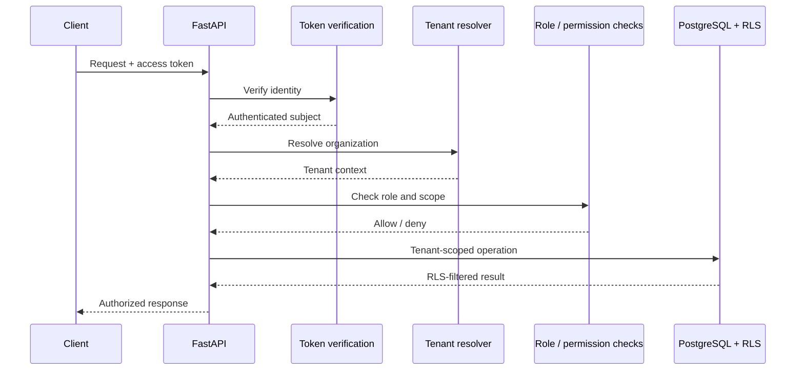

**Engineering focus**
- Server-side JWT verification and role-based authorization.
- Organization-scoped operations and multi-tenant boundaries.
- PostgreSQL RLS as a second authorization layer.
- Operational models for expedition lifecycle, personnel, cargo, assets, inventory, and incidents.
- Audit logging and integration tests for access and workflow behavior.

**Core rule:** the client can request an action; it does not get to decide whether that action is allowed.


## ◈ Questbound


[](https://github.com/kunalchwdry/Questbound)
[](https://github.com/kunalchwdry/Questbound)

**🏆 Tech Zephyr 4.0 — Grand Finale Finalist, IIT Bhubaneswar**

Questbound turns productivity into a game system built around quests, XP, gold, attributes, streaks, and an AI companion called the Oracle. Selected for the offline Grand Finale, involving a pitch, live demo, and technical Q&A.

**Stack:** Next.js · React · PostgreSQL · Supabase · Drizzle ORM · Multi-provider LLM routing · Naive Bayes

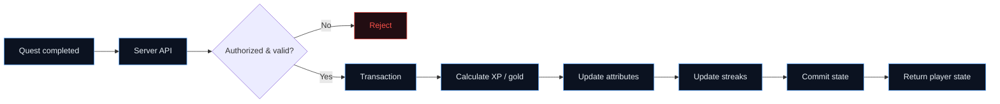

**The interesting engineering**
- Server-authoritative reward calculation; the browser never chooses its own rewards.
- Transactional updates for progression state.
- Oracle companion with multi-provider routing and fallback behavior.
- Lightweight local Naive Bayes emotion classification feeding structured context.
- 24+ architecture decision records documenting key system decisions.
- Test hardening across pure logic, SQL behavior, and end-to-end flows.
- Additive migration workflow with fingerprint checks and advisory locking.

**Design split:** deterministic code handles critical state; the LLM sits at the product's flexible edge.


## ◈ DataVortex


[](https://github.com/kunalchwdry/data-vortex-2026)

**AARUUSH '26 · SRM Institute of Science and Technology · "Rebuilding the Social Engine"**

A three-round pipeline that rebuilt a simulated social platform's data, semantic layer, and live signal tracking. The work emphasizes reproducibility, explicit data repairs, and honest evaluation.

**Stack:** Python · pandas · scikit-learn · TF-IDF · SQLite · Jupyter · Mann–Whitney U · public data sources

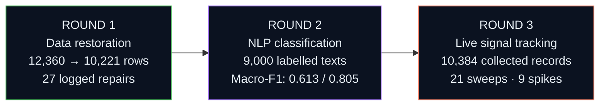

**Round 1 — Data restoration**
- Recovered 12,360 corrupted rows into 10,221 analysis-ready records.
- Logged 27 individually justified, reversible repairs instead of silently altering data.
- Built a SQLite analysis core and answered the analytical question set with SQL.
- Reproducible pipeline with automated tests.

**Round 2 — Semantic recovery**
- Evaluated sentiment and topic classification over 9,000 labelled texts.
- Compared TF-IDF and linear models, with LDA/NMF cross-checks.
- Reported sentiment macro-F1 of **0.6134** and topic macro-F1 of **0.8051**.
- Used a fixed split and seed, with explicit error analysis.

**Round 3 — Live signal tracking**
- Collected **10,384 records** across **21 sweeps** and **5 languages**.
- Logged HTTP outcomes and used public sources under their applicable access constraints.
- Applied the Round 2 model to the collected data without retraining it on the target results.
- Reported **9 engagement spikes** and a gold-day positivity shift from **0.391 to 0.306** with **Mann–Whitney U, p = 0.0043**.

**Why it matters:** data integrity → applied ML → live analysis, connected into one reproducible pipeline.

> "The data survived. It understood. Now it watches back." — ARCHIVE NODE 07


## ◈ InnerLoop


InnerLoop explores the loop between planning, focus, habits, learning, and measurable improvement. It is a separate project from Questbound: InnerLoop emphasizes structured planning and analytics, while Questbound explores game mechanics.

**Stack:** React · Vite · Supabase · PostgreSQL · Tailwind CSS

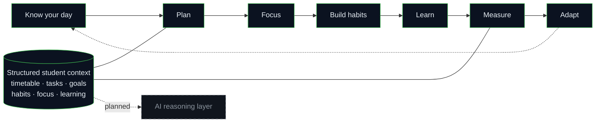

**Implemented foundations:** timetable context, tasks and goals, habits and focus, learning tracking, analytics, adaptive-planning foundations, and structured AI-ready data.

**Planned:** the full AI context and reasoning layer.


## ◈ Anaya Health Assistant


[](https://github.com/kunalchwdry/anaya-health-assistant)

Anaya explores voice-first healthcare information with a focus on Hinglish and Indian-language accessibility. It is designed to be **non-diagnostic and non-prescriptive**.

**Stack:** LiveKit Agents · SIP · Gemini · Deepgram · Murf Falcon · SQLite

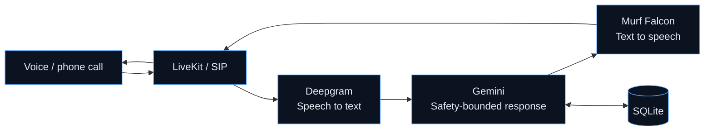

- Voice-first interaction to reduce dependence on text-heavy interfaces.
- Hinglish-oriented conversational experience.
- Information and guidance rather than diagnosis or prescription.
- Speech-to-text → language model → text-to-speech pipeline.


## ◈ SHIELD-COM


**Smart India Hackathon 2026 · Team entry / college internal round**

A hardware-software concept exploring embedded speech processing and active-noise-cancellation approaches for communication in noisy operational environments.

**Stack:** ESP32-S3 · ESP-SR · Embedded systems · Speech processing

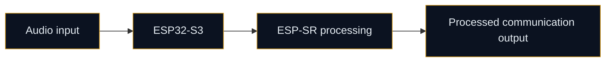

The project explores the hardware/software boundary and on-device speech-processing capabilities. The diagram represents the intended system direction, not a claim that every component is production-validated.


## ◈ NoLimi


A Python assistant combining natural-language interaction with voice input, speech output, browser automation, and application launching.

**Stack:** Python · Gemini API · Speech recognition · TTS · Browser automation

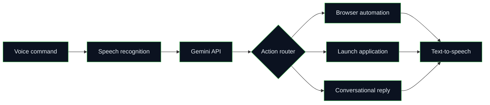

**Exploration direction:** AI + desktop automation + cybersecurity. This is an ongoing direction, not a claim that every possible automation feature is complete.


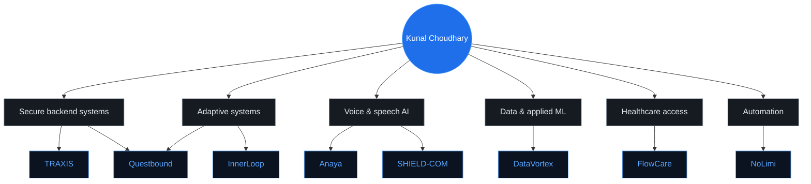

| Project | Domain | Core technologies |
| --- | --- | --- |
| [FlowCare](https://github.com/kunalchwdry/FlowCare) | Healthcare discovery & coordination | Next.js, TypeScript, Supabase, PostgreSQL, RLS |
| [TRAXIS](https://github.com/kunalchwdry/Traxis) | Polar logistics & asset management | React, Vite, FastAPI, PostgreSQL, JWT, RBAC |
| [Questbound](https://github.com/kunalchwdry/Questbound) | Adaptive productivity RPG | Next.js, PostgreSQL, Supabase, Drizzle, LLM routing |
| InnerLoop | Student productivity | React, Vite, Supabase, PostgreSQL |
| [Anaya](https://github.com/kunalchwdry/anaya-health-assistant) | Voice healthcare information | LiveKit, Gemini, Deepgram, Murf |
| SHIELD-COM | Embedded speech processing | ESP32-S3, ESP-SR |
| NoLimi | Desktop assistant & automation | Python, Gemini API, speech tools |
| [DataVortex](https://github.com/kunalchwdry/data-vortex-2026) | Data science & live analysis | pandas, scikit-learn, TF-IDF, SQLite |


<div align="center">


</div>

| Layer | Tools & concepts |
| --- | --- |
| **AI / LLM** | Gemini API, multi-provider routing, NLP, Naive Bayes, LLM applications |
| **Machine learning** | pandas, scikit-learn, TF-IDF, evaluation, statistical testing, Jupyter |
| **Voice & speech** | LiveKit Agents, SIP, Deepgram, Murf Falcon, speech recognition, TTS, ESP-SR |
| **Backend** | Python, FastAPI, Next.js route handlers, REST APIs, validation, integration testing |
| **Data** | PostgreSQL, Supabase, SQLite, RLS, Drizzle ORM, transactional workflows |
| **Security** | JWT verification, RBAC, tenant scoping, audit logging, server-side authorization |
| **Frontend** | React, Next.js, TypeScript, Vite, Tailwind CSS |
| **Embedded** | ESP32-S3, on-device speech-processing exploration |
| **Workflow** | Git, GitHub, automation, reproducible pipelines |


| Event / track | Work |
| --- | --- |
| **Tech Zephyr 4.0 — IIT Bhubaneswar** | 🏆 Questbound selected as a Grand Finale Finalist; offline pitch, demo, and technical Q&A |
| **AARUUSH '26 — DataVortex** | Three-round pipeline: restoration → NLP → live signal tracking |
| **Smart India Hackathon 2026** | Team work across TRAXIS and SHIELD-COM problem tracks |


<details open>
<summary><b>Active learning tracks</b></summary>
<br/>

| Track | Current focus |
| --- | --- |
| **ML foundations** | Core concepts, data preparation, training and evaluation |
| **Deep learning** | PyTorch, neural networks, practical model workflows |
| **LLM systems** | RAG, agentic architectures, evaluation, failure analysis |
| **Backend engineering** | API design, authorization, testing, reliability |
| **System design** | Data modeling, tenant boundaries, scalable architecture |

</details>


<div align="center">


<br/><br/>


<br/><br/>


<br/>


</div>

```text
┌──(kunal㉿github)-[~/telemetry]
└─$ ./mission-report

  grand finale finalist ......... Tech Zephyr 4.0 · IIT Bhubaneswar
  competition rounds shipped .... 3 · DataVortex
  records collected ............. 10,384
  collection sweeps ............. 21
  languages in collected data ... 5
  reported statistical result ... p = 0.0043
  architecture decision records . 24+
```

<sub>Stats cards are generated by third-party services and may occasionally be unavailable or delayed. Project metrics above describe the stated project runs, not live GitHub counters.</sub>


*You wake up inside THE SOCIAL ENGINE. Corrupted rows shimmer across the floor. A terminal flickers in the dark:*


**Choose your route:**

| Portal | Mission |
| --- | --- |
| 🗃️ [Enter the Data Caves](#-datavortex) | Follow the evidence. Repair the records. Track the signal. |
| 🎙️ [Climb the Voice Tower](#-anaya-health-assistant) | Explore voice-first AI and speech pipelines. |
| 🔐 [Enter the Security Vault](#-traxis) | Cross the tenant boundary without breaking authorization. |
| 🧪 [Visit the Alchemist](#-questbound) | Build systems where deterministic rules meet adaptive AI. |
| 🏥 [Open FlowCare](#-flowcare) | Trace a claim back to its source. |

<details>
<summary>💎 <b>Secret room: The Golden Record</b></summary>
<br/>

```text
☠ FINAL BOSS — MISSION 2030
TARGET: AI INFRASTRUCTURE
STATUS: ACTIVE

WEAPONS:
  [x] foundations first
  [x] server decides
  [x] validate before you claim
  [x] measure, then improve

CRITICAL HIT:
  Data integrity → applied intelligence → useful systems
```

**Achievement unlocked:** keep building things that survive contact with reality.

</details>


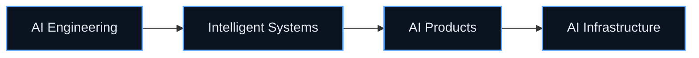

The goal is to build deep technical foundations, ship increasingly complex AI systems, and become an engineer who can design intelligent products end-to-end — from data and infrastructure to the user experience.

Not a claim that the mission is complete. **A direction worth earning.**


<div align="center">

[](https://github.com/kunalchwdry)
[](https://www.linkedin.com/in/kunal-choudhary-918270425/)

**Open to collaborating on AI systems, backend platforms, data pipelines, and real-world intelligent software.**


<br/>


</div>
