<div align="center">


<a href="https://github.com/kunalchwdry">
  
</a>

**AI Engineer in Progress · AI Builder · Backend & Intelligent Systems**

I build intelligent systems that connect **AI, software engineering, data, automation, and real-world workflows**.<br/>
2nd-year BE AI & Data Science student from India, working across LLM applications, voice AI, secure backends, and adaptive systems.

[](https://github.com/kunalchwdry)
[](https://www.linkedin.com/in/kunal-choudhary-918270425/)
[](#connect)


<marquee scrollamount="6"><b>🏆 TECH ZEPHYR 4.0 GRAND FINALIST — IIT BHUBANESWAR</b> · 📊 p = 0.0043 · 🗃️ 10,384 records collected · ⚡ 24+ ADRs </marquee>

[Currently Building](#currently-building) · [Philosophy](#engineering-philosophy) · [Projects](#featured-projects) · [Tech Stack](#tech-stack) · [GitHub Activity](#github-activity) · [Mission 2030](#mission-2030)

</div>

---

```text
┌──(kunal㉿forge-x)-[~]
└─$ whoami
   ai_engineer_in_progress --year=2 --base=India
└─$ cat current_status.log
   [OK]   building AI systems          ▓▓▓▓▓▓▓▓▓░  shipping
   [OK]   secure backends             ▓▓▓▓▓▓▓▓▓░  production-minded
   [▚▚▚]  ML foundations              ▓▓▓▓▓░░░░░  going deeper
└─$ ./life --run
   building → learning → experimenting → shipping → repeat
```

---

## 🎮 Save File №1 — Character Sheet

```text
╭──────────────── SAVE FILE №1 ────────────────╮
  PLAYER   : Kunal Choudhary
  CLASS    : AI Engineer (Lv.2 → Lv.99 @ 2030)
  GUILD    : Keystone School of Engineering, Pune
  PARTY    : Forge-X · Team SHIELD · Questbound
  TITLE    : 🏆 Grand Finalist — Tech Zephyr 4.0
╰──────────────────────────────────────────────╯

  BACKEND        ███████████████░░░░░  75
  AI / LLM       ██████████████░░░░░░  70
  DATA SCIENCE   ████████████░░░░░░░░  60
  VOICE AI       ████████████░░░░░░░░  60
  EMBEDDED       ██████████░░░░░░░░░░  50
  SHIP-IT        ████████████████████ 100

  ☠ BOSS — MISSION 2030 ......... [AWAKE] [ACCEPTING CHALLENGERS]
```

---

## About

```yaml
name: Kunal Choudhary
role: AI Engineer in Progress
education: BE Artificial Intelligence & Data Science (2nd year)
location: India

direction: AI Engineering → Intelligent Systems → AI Products → AI Infrastructure

builds:
  - Secure backend platforms (JWT, RBAC, PostgreSQL RLS)
  - Server-authoritative transactional systems
  - LLM-powered and voice-first applications
  - Adaptive productivity systems
  - Desktop and workflow automation
  - Embedded speech-processing systems
  - End-to-end data science pipelines (collection → model → report)

approach: building → learning → experimenting → shipping
mission: 2030
```

---

## Currently Building

| Area | What that looks like in my projects |
|---|---|
| `AI / LLM Applications` | Gemini-powered assistants, multi-provider LLM architecture with failover |
| `Voice AI` | Conversational voice pipelines with STT → LLM → TTS |
| `Backend Engineering` | FastAPI services, JWT auth, RBAC, audit logging, integration testing |
| `Data Systems` | PostgreSQL / Supabase schema design, Row Level Security, transactional logic |
| `Adaptive Systems` | Productivity loops that plan, measure, and adapt |
| `Automation` | Voice-driven desktop control, browser automation, app launching |
| `Embedded AI` | ESP32-S3 + ESP-SR speech processing and noise cancellation |
| `Data Science Competitions` | Multi-round national hackathon pipelines — real-time collection, NLP, statistical testing |

---

## Engineering Philosophy

I don't treat AI as a feature bolted onto an app. Intelligence is only as reliable as the data, backend, and authorization layers underneath it.

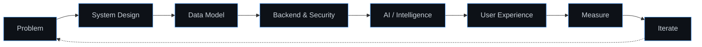

- **Foundations first** — schema design, server-side validation, and access control before AI.
- **Structured context over loose prompts** — AI works better when it reasons over well-modeled data.
- **Server-authoritative logic** — critical state (permissions, rewards, records) is never trusted to the client.
- **Validate before you claim** — a number without a validation story is just decoration.

---

## Featured Projects

### Project Map

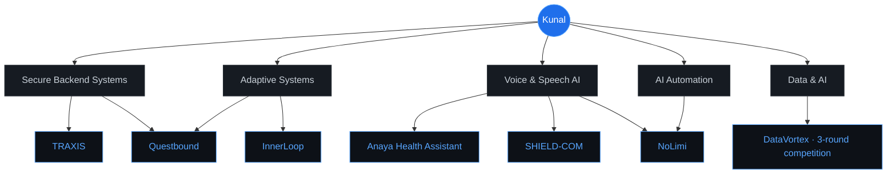

### Overview

| Project | Domain | Core Stack | Repository |
|---|---|---|---|
| **TRAXIS** | Polar expedition logistics & asset management | React · Vite · TypeScript · FastAPI · PostgreSQL · Supabase | [Traxis](https://github.com/kunalchwdry/Traxis) |
| **Questbound** 🏆 | Life RPG — **Tech Zephyr 4.0 (IIT BBS) Grand Finale Finalist** | Next.js · React · PostgreSQL · Supabase · Drizzle ORM | [Questbound](https://github.com/kunalchwdry/Questbound) |
| **InnerLoop** | Student productivity & continuous improvement | React · Vite · Supabase · PostgreSQL · Tailwind CSS | — |
| **Anaya Health Assistant** | Voice AI for healthcare access | LiveKit Agents · Gemini · Deepgram · Murf Falcon · SQLite | [anaya-health-assistant](https://github.com/kunalchwdry/anaya-health-assistant) |
| **SHIELD-COM** | Embedded speech processing for soldier communication | ESP32-S3 · ESP-SR | — |
| **NoLimi** | Personal AI desktop assistant | Python · Gemini API · Speech Recognition · TTS | — |
| **DataVortex** | National data-science competition — 3-round saga | Python · scikit-learn · pandas · keyless APIs · Jupyter | [data-vortex-2026](https://github.com/kunalchwdry/data-vortex-2026) |

> Click any section below to expand the architecture and engineering details.

---

### TRAXIS

**Integrated Polar Expedition Logistics & Asset Management System**

`Smart India Hackathon 2026 (PS 26062 · MoES / NCPOR) — built as our option B; we entered with SHIELD-COM`

A multi-tenant operational platform for managing polar expeditions — personnel, cargo, assets, inventory, incidents, and organization access — with authorization enforced on the server and at the database layer.

`React` `Vite` `TypeScript` `FastAPI` `PostgreSQL` `Supabase` `JWT` `RBAC` `RLS`

<details>
<summary><b>Authorization Pipeline</b></summary>

<br/>

Every request passes through a server-authoritative chain. The client never decides what a user is allowed to see or change.

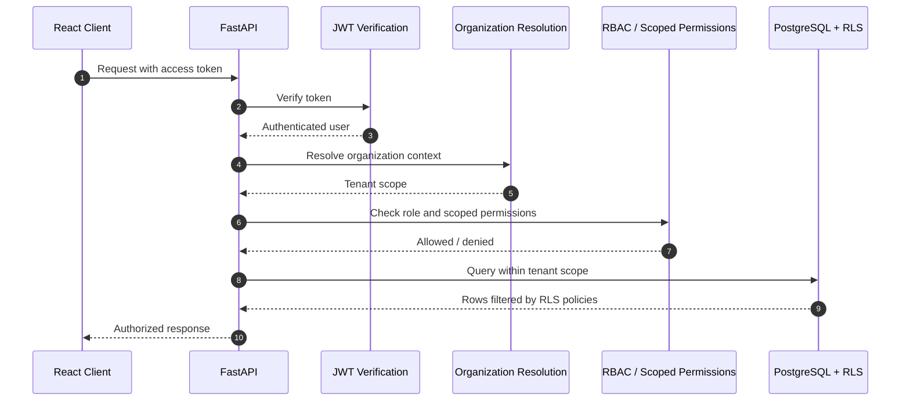

- **Defense in depth** — authorization is checked in the API layer *and* enforced by PostgreSQL Row Level Security.
- **Multi-tenancy** — organization resolution scopes every operation to the correct tenant.
- **Auditability** — audit logging records operational actions.

</details>

<details>
<summary><b>Operational Domain Model</b></summary>

<br/>

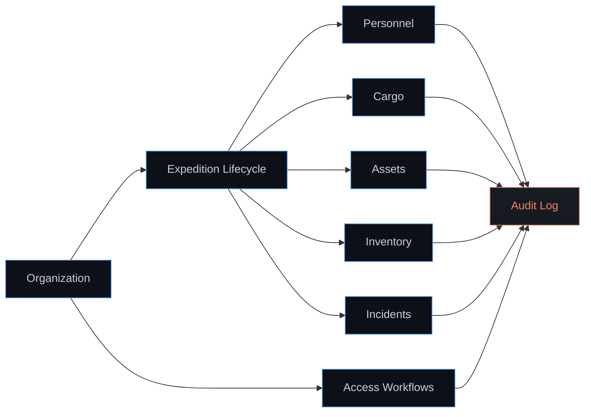

</details>

<details>
<summary><b>What I Built</b></summary>

<br/>

- Designed a multi-tenant architecture for polar expedition logistics.
- Implemented JWT authentication with role-based access control and scoped permissions.
- Secured data access with PostgreSQL Row Level Security.
- Modeled expedition lifecycle, personnel, cargo, assets, inventory, and incident workflows.
- Built organization access workflows for tenant onboarding and membership.
- Added audit logging for operational traceability.
- Wrote backend integration tests to validate authorization and workflow behavior.

</details>

---

### Questbound

**A Life RPG — Gamified Adaptive Productivity Platform**

`🏆 Tech Zephyr 4.0 (IIT Bhubaneswar) — Grand Finale Finalist`

Questbound turns productivity into an adaptive game system. Quests, XP, gold, attributes, and streaks are calculated by a server-side transactional engine, while an AI companion — the Oracle — adapts to the user's emotional context. Selected for the offline Grand Finale at IIT Bhubaneswar: pitch + live demo + technical Q&A.

`Next.js` `React` `PostgreSQL` `Supabase` `Drizzle ORM` `Multi-Provider LLM` `Naive Bayes`

<details>
<summary><b>Server-Authoritative Game Engine</b></summary>

<br/>

Rewards are never calculated on the client. Every progression change is validated and committed as a transaction.

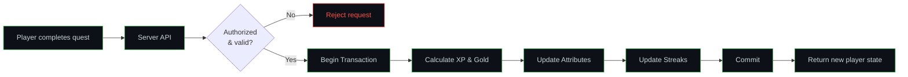

- **Anti-cheat by design** — the client submits actions, the server decides outcomes.
- **Transactional integrity** — XP, gold, attributes, and streaks update atomically.

</details>

<details>
<summary><b>Oracle AI Companion</b></summary>

<br/>

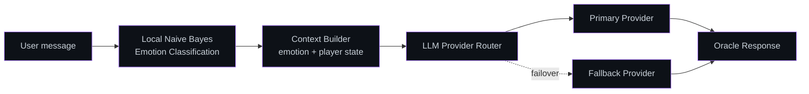

- **Local emotion classification** with Naive Bayes — lightweight, runs without an external API call.
- **Multi-provider LLM architecture** with failover for resilience.

</details>

<details>
<summary><b>What I Built</b></summary>

<br/>

- Engineered a server-side transactional game engine for quests, XP, gold, attributes, and streaks.
- Designed server-authoritative reward calculation with authorization checks.
- Integrated adaptive planning into the RPG progression model.
- Built the Oracle AI companion with multi-provider LLM routing and failover.
- Implemented local Naive Bayes emotion classification.
- Added community and social features around shared progress.

**Engineering depth (the finale demo story):**

- **ADR-driven development** — 24+ architecture decision records (deterministic core / LLM-periphery split, `quest_events` append-only ledger, plan-state-as-metadata, sandbox strategy).
- **Test hardening** — 31 pure-logic checks, pg-mem SQL verification, and a 40-check end-to-end suite on embedded Postgres.
- **Zero-loss production migration** — fingerprint-verified additive migrations with advisory locking; 77 live quest rows migrated with fingerprints preserved.
- **Deploy-ready** — Next.js at repo root for zero-config Vercel builds, `.env.example` contract, no secrets in the tree.

</details>

---

### DataVortex

**National Data Science Competition — the 3-round "Social Engine" saga**

`AARUUSH '26 (SRM IST)` · `Theme: Rebuilding the Social Engine` · `Solo · Team Forge-X`

A three-round national competition where a corrupted social-media platform ("The Social Engine") had to be rebuilt end-to-end — first the data, then the meaning, then the live pulse. Everything below is one repo, fully reproducible, every number generated by the pipeline.

`Python` `pandas` `scikit-learn` `TF-IDF` `Mann-Whitney U` `keyless APIs` `RSS · Mastodon · GDELT · Bing` `Jupyter` `SQLite`

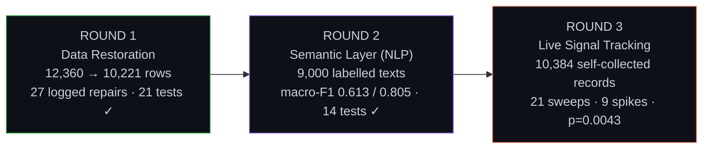

<details>
<summary><b>Round 1 — Data Restoration</b></summary>

<br/>

Recovered a corrupted posts + users dataset from a simulated broken platform through an interactive recovery challenge.

- Cleaned 12,360 corrupted rows → 10,221 analysis-ready records with **27 individually justified repairs** (each one logged and reversible — no silent fixes).
- Built a schema'd SQLite core and answered the analytical question set with 45 SQL queries.
- The arithmetic closes exactly: `12,360 − 360 − 1,779 = 10,221`. Reproducible via `./run_all.sh` → 21 tests passing.

</details>

<details>
<summary><b>Round 2 — Semantic Recovery (NLP)</b></summary>

<br/>

Rebuilt the platform's comprehension layer: sentiment and topic classification over 9,000 labelled texts.

- Model bake-off (TF-IDF + linear models, LDA/NMF cross-check) with a strict discipline: **one split, one seed, one touch of the test set**.
- Sentiment macro-F1 **0.6134**, topic macro-F1 **0.8051** — with error analysis that read the mistakes instead of averaging them away.
- One-split/one-seed honesty rules, margins reported not celebrated. Reproducible via `./run_round2.sh` → 14 tests passing.

</details>

<details>
<summary><b>Round 3 — Signal Tracking (the model goes live)</b></summary>

<br/>

The restored model was pushed into a living conversation: collect real public data in real time around an assigned topic, and detect behavioural shifts as they happen.

- **10,384 self-collected records** across 21 sweeps and 5 languages — keyless, ToS-respecting sources only; every HTTP outcome logged.
- Team-manual X & YouTube datasets imported through an **authenticity gate** (every snowflake ID decoded and timestamp-matched; 100% pass).
- Applied the Round-2 model unchanged to live data. Detected **9 engagement spikes** and a statistically significant gold-day positivity shift — **0.391 → 0.306, Mann-Whitney p = 0.0043** — a pride/grievance signature predicted before the match from the event's history.
- Executed real-time notebook (23 cells, 0 errors), 8-section analytical report, one-command reproducibility via `./run_round3.sh`.

</details>

<details>
<summary><b>Why this project matters to me</b></summary>

<br/>

It is the full arc I care about: **data integrity → applied ML → live intelligent systems**, under competition constraints and honesty rules. No step was faked, no number was hand-written — the report is a printout of what the pipeline produced.

```text
"The data survived. It understood. Now it watches back."
                                   — ARCHIVE NODE 07
```

</details>

---

### InnerLoop

**AI-Powered Student Productivity & Continuous-Improvement Platform**

A connected system that moves students from knowing their day to measurable improvement — built on structured student context and an AI-ready architecture.

`React` `Vite` `Supabase` `PostgreSQL` `Tailwind CSS`

<details>
<summary><b>The Improvement Loop</b></summary>

<br/>

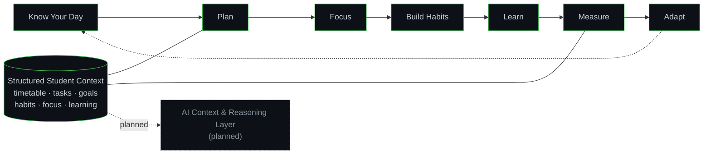

</details>

<details>
<summary><b>Build Status</b></summary>

<br/>

| Component | Status |
|---|---|
| Timetable context | Implemented |
| Tasks & goals | Implemented |
| Habits & focus | Implemented |
| Learning tracking | Implemented |
| Analytics | Implemented |
| Adaptive planning foundations | Implemented |
| Structured, AI-ready data architecture | Implemented |
| Full AI context & reasoning layer | **Planned** |

</details>

**Connection to Questbound:** both explore adaptive productivity — InnerLoop through structured planning and analytics, Questbound through game mechanics. They are separate projects.

---

### Anaya Health Assistant

**Voice AI for Accessible Healthcare Information**

A voice-first conversational assistant focused on healthcare access, Hinglish and Indian-language accessibility, and a strictly non-diagnostic, non-prescriptive design.

`LiveKit Agents` `SIP` `Gemini` `Deepgram` `Murf Falcon` `SQLite`

<details>
<summary><b>Voice Pipeline</b></summary>

<br/>

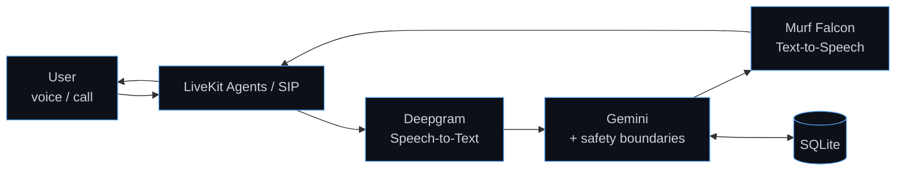

</details>

<details>
<summary><b>Design Principles</b></summary>

<br/>

- **Voice-first** — lowers the barrier for users who find text interfaces difficult.
- **Hinglish / Indian-language accessibility** — designed around how users actually speak.
- **Non-diagnostic & non-prescriptive** — provides information and guidance, not diagnoses or prescriptions.

</details>

---

### SHIELD-COM

**Embedded AI Speech Processing for Soldier Communication**

`Smart India Hackathon 2026 — our team's entry (college internal round)`

A hardware-software system exploring active noise cancellation and neural speech processing for communication in noisy operational environments.

`ESP32-S3` `ESP-SR` `Embedded Systems` `Speech Processing`

<details>
<summary><b>System Flow</b></summary>

<br/>

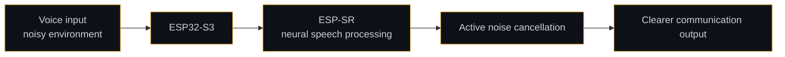

- Hardware-software integration on the ESP32-S3.
- On-device speech processing using the ESP-SR framework.

</details>

---

### NoLimi

**Personal AI Desktop Assistant**

A Python assistant that combines natural-language interaction with desktop automation.

`Python` `Gemini API` `Speech Recognition` `Text-to-Speech` `Browser Automation`

<details>
<summary><b>Command Flow</b></summary>

<br/>

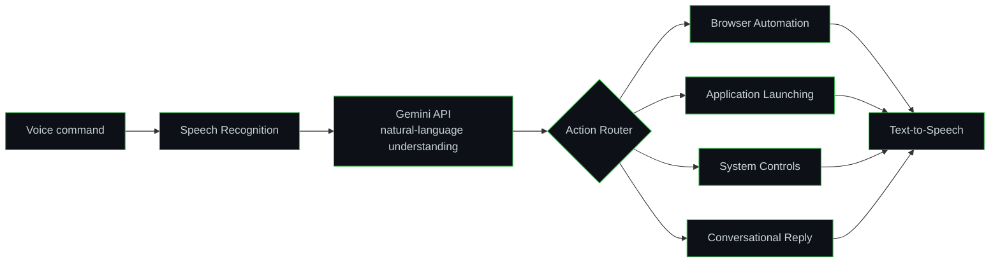

- **Broader direction:** `AI + Desktop Automation + Cybersecurity` — an ongoing direction, not a completed feature set.

</details>

---

## 🕹️ THE QUEST — Play My Portfolio

*You wake up inside THE SOCIAL ENGINE. Corrupted data glitters on the floor like broken glass.
Somewhere in the dark, a machine whispers:* **"p = 0.0043…"**

**CHOOSE YOUR PATH:**

| | |
|---|---|
| 🗃️ [Follow the data trail →](#room-1-the-data-caves) | 🎙️ [Climb the Voice Tower →](#room-2-the-voice-tower) |
| 🔐 [Force the Security Vault →](#room-3-the-security-vault) | 🧪 [Enter the Mad Alchemist's Lab →](#room-4-the-alchemists-lab) |

<details>
<summary>💎 <b>…or search for the GOLDEN RECORD (secret ending)</b></summary>

<br/>

You crawl past the broken terminal into the deepest chamber of the Social Engine. Something enormous is breathing in there.

| | |
|---|---|
| ⚔️ [**FACE THE FINAL BOSS →**](#room-5-the-golden-record) | |
</details>

---

#### Room 1: The Data Caves

The tunnel floor is made of 12,360 corrupted rows. Bats with duplicate IDs swoop at you.

> **ROLL FOR INITIATIVE** — you dodge **4 duplicates**, decode the **snowflake runes**, and refuse the tempting shortcut through the Login Wall.
>
> 🎁 **LOOT DROPPED:** a glowing scroll — `10,384 unique records · 21 sweeps · every HTTP outcome logged`
>
> → [Examine the scroll (DataVortex)](#datavortex) · [Deeper into the caves →](#room-4-the-alchemists-lab)

---

#### Room 2: The Voice Tower

A tower with no text interface — only voices. A guardian blocks the stair: *"Speak, human."*

> You whisper in **Hinglish**. The guardian nods — accessibility check passed.
>
> 🎁 **LOOT DROPPED:** `STT → LLM → TTS pipeline` + `on-device ESP-SR speech processing`
>
> → [Meet Anaya](#anaya-health-assistant) · [Inspect SHIELD-COM](#shield-com) · [Climb down →](#room-3-the-security-vault)

---

#### Room 3: The Security Vault

A door with 7 locks: JWT, RBAC, RLS, tenant scope, audit log… The doorman asks one question:

> *"Who decides what the client may do?"*
>
> You answer: **"The server. Always the server."** — all 7 locks open at once.
>
> 🎁 **LOOT DROPPED:** `multi-tenant platform · integration-tested auth pipeline`
>
> → [Enter TRAXIS](#traxis) · [Move on →](#room-4-the-alchemists-lab)

---

#### Room 4: The Alchemist's Lab

An RPG kingdom runs inside a browser. An Oracle murmurs probabilities. A Naive-Bayes dice rolls itself.

> The Alchemist gestures at a trophy case: **GRAND FINALE — IIT BHUBANESWAR**.
>
> 🎁 **LOOT DROPPED:** `server-authoritative game engine · 40-check e2e suite · 24+ ADRs`
>
> → [Enter Questbound](#questbound) · [⭐ Quick-time event: star the repo](https://github.com/kunalchwdry/Questbound)

---

#### Room 5: The Golden Record

*Hidden room. If you are reading this, you actually clicked — respect. 🥷*

The final boss wakes:

```text
  ☠ FINAL BOSS — MISSION 2030
  HP: ████████████████████ 100%   [AI INFRASTRUCTURE]
```

You attack with **"foundations first"**, counter with **"validate before you claim"**, and finish it with the forbidden spell nobody expected from a Lv.2:

```text
  CRITICAL HIT — Mann-Whitney U, p = 0.0043
  "The data survived. It understood. Now it watches back."
```

**🏆 ACHIEVEMENTS UNLOCKED**

```text
  ├─ 🏆 Grand Finalist — Tech Zephyr 4.0, IIT Bhubaneswar
  ├─ 📊 The Significant One — gold-day shift, p = 0.0043
  ├─ 🗃️ Snowflake Whisperer — 100% authenticity gate pass
  ├─ 🔁 The 3-Round Saga — Data Vortex, all rounds shipped
  └─ 🥷 Secret Seeker — you found this room
```

| | |
|---|---|
| 🔁 [R — RESPAWN AT START](#-the-quest--play-my-portfolio) | ⚔️ [Join the party (Connect)](#connect) |

---

## 🎲 Random Encounter

*This page is alive — every refresh spawns something new.*

| 🃏 Dev joke roll | 📜 Scroll of wisdom |
|---|---|
|  |  |

---

## Tech Stack

<div align="center">


</div>

<br/>

| Layer | Technologies |
|---|---|
| **AI / LLM** | `Gemini API` · `Multi-Provider LLM Routing` · `Naive Bayes` · `NLP` |
| **Voice & Speech** | `LiveKit Agents` · `SIP` · `Deepgram` · `Murf Falcon` · `Speech Recognition` · `Text-to-Speech` · `ESP-SR` |
| **Backend** | `Python` · `FastAPI` · `REST APIs` · `JWT` · `RBAC` · `Audit Logging` · `Integration Testing` |
| **Data** | `PostgreSQL` · `Supabase` · `Row Level Security` · `Drizzle ORM` · `SQLite` · `Transactional Systems` |
| **Data Science** | `pandas` · `scikit-learn` · `TF-IDF` · `statistical testing` · `Jupyter` |
| **Frontend** | `React` · `Next.js` · `TypeScript` · `Vite` · `Tailwind CSS` |
| **Embedded** | `ESP32-S3` |
| **Tools** | `Git` · `GitHub` · `Browser Automation` |

---

## Competition Track

| Competition | What I shipped |
|---|---|
| **Tech Zephyr 4.0 — IIT Bhubaneswar** | 🏆 **Grand Finale Finalist** — Questbound (offline finale: pitch + live demo + Q&A) |
| **AARUUSH '26 — Data Vortex** | 3-round "Social Engine" saga — restoration → NLP → live signal tracking ([repo](https://github.com/kunalchwdry/data-vortex-2026)) |

---

## GitHub Activity

<div align="center">


<br/><br/>


</div>

```text
┌──(kunal㉿github)-[~/stats]
└─$ ./fetch --lifetime
   grand finals reached ........ 1       → Tech Zephyr 4.0, IIT Bhubaneswar
   national rounds shipped ..... 3       → Data Vortex, all of them
   records self-collected ...... 10,384  → 21 sweeps · 5 languages
   significant results ......... 1       → p = 0.0043
   ADRs written ................ 24+     → Questbound
   secrets hidden in profile ... 1       → did you find it?
```

---

---

## What I Like Building

| | |
|---|---|
| **AI-powered applications** | LLM assistants, voice agents, AI companions |
| **Secure backend platforms** | Multi-tenant APIs with RBAC, RLS, and audit trails |
| **Adaptive systems** | Products that measure behavior and adapt over time |
| **Automation tools** | Voice-driven desktop and browser automation |
| **Embedded AI** | On-device speech processing on microcontrollers |
| **Real-world operational software** | Logistics, healthcare access, student workflows |

---

## Engineering Interests

`Artificial Intelligence` · `Machine Learning` · `Generative AI` · `LLMs & Agents` · `Voice AI` · `Backend Systems` · `Data Systems` · `Computer Vision` · `Cybersecurity` · `Embedded AI` · `Developer Tools` · `Intelligent Automation`

---

## Current Learning

<details open>
<summary><b>What I'm going deeper on</b></summary>

<br/>

| Track | Focus |
|---|---|
| **ML Foundations** | Core machine learning concepts and model training |
| **Deep Learning** | PyTorch and neural-network workflows |
| **LLM Systems** | RAG, agentic architectures, evaluation |
| **Backend Engineering** | API design, testing, reliability |
| **System Design** | Data modeling, authorization, scalable architecture |

```text
building → learning → experimenting → shipping → repeat
```

</details>

---

## Mission 2030

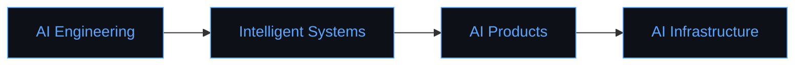

> Build deep technical foundations, ship increasingly complex AI systems, and grow into an engineer capable of designing intelligent systems end-to-end.

---

## 🔓 Unlockables — level up this profile

```text
  PROFILE SETUP PROGRESS   [■■■□□□□□□□]  3/10
  ☑ profile README          ☑ trophy cards        ☑ the quest (secret room)
  ☐ contribution snake      ☐ 3D skyline          ☐ wakatime     ☐ discord live
```

<details>
<summary>🐍 <b>Contribution Snake</b> — <i>2 min setup · auto-refreshes daily</i></summary>

<br/>

**Preview (demo):**

<picture>
  <source media="(prefers-color-scheme: dark)" srcset="https://raw.githubusercontent.com/Platane/snk/output/snake-dark.svg" />
  
</picture>

**Setup —** in the profile repo (`kunalchwdry/kunalchwdry`) create `.github/workflows/snake.yml`:

```yaml
name: Generate Snake
on:
  schedule: [{cron: "0 0 * * *"}]
  workflow_dispatch:
jobs:
  generate:
    runs-on: ubuntu-latest
    permissions:
      contents: write
    steps:
      - uses: Platane/snk/svg-only@v3
        with:
          github_user_name: kunalchwdry
          outputs: |
            dist/snake.svg
            dist/snake-dark.svg?palette=github-dark
      - uses: crazy-max/ghaction-github-pages@v4
        with:
          target_branch: output
          build_dir: dist
        env:
          GITHUB_TOKEN: ${{ secrets.GITHUB_TOKEN }}
```

Run it once (Actions → Generate Snake → Run), then paste this where the snake should live:

```markdown
<picture>
  <source media="(prefers-color-scheme: dark)" srcset="https://raw.githubusercontent.com/kunalchwdry/kunalchwdry/output/snake-dark.svg" />
  
</picture>
```

</details>

<details>
<summary>🌌 <b>GitHub Skyline</b> — <i>2 min · a 3D city of my 2026 commits</i></summary>

<br/>

**Setup —** go to [skyline.github.com](https://skyline.github.com/) → enter `kunalchwdry` → export the GIF → commit it to the profile repo (e.g. `assets/skyline-2026.gif`) → embed:

```markdown

```

</details>

<details>
<summary>⏱️ <b>WakaTime</b> — <i>10 min · live "what I'm coding" stats</i></summary>

<br/>

**Setup —** sign up at [wakatime.com](https://wakatime.com) → install the editor plugin → code for a few days → make the dashboard public → embed (⚠️ use your **self-hosted** instance from the unlock below — the shared public one is dead):

```markdown

```

</details>

<details>
<summary>📊 <b>Live Stats Cards — self-hosted</b> <i>(10 min · the famous stats/trophy/graph cards, on my own free Vercel)</i></summary>

<br/>

The famous stat cards broke **for everyone** — the shared public instance is `DEPLOYMENT_PAUSED` (the whole internet hammers it). The permanent fix is running **my own free copy**:

1. Fork [ryo-ma/github-readme-stats](https://github.com/ryo-ma/github-readme-stats)
2. Create a fine-grained **PAT** (Settings → Developer settings): All repositories → **Public repositories, read-only** — nothing more
3. [vercel.com](https://vercel.com) → sign in **with GitHub** (free, no card) → Add New Project → import the fork → Environment Variables → `PAT_1` = the token → Deploy
4. Use my own instance's URLs in this README:

```markdown

```

Same fork-and-deploy trick works for [the trophy card](https://github.com/ryo-ma/github-profile-trophy) and [the activity graph](https://github.com/Ashutosh00710/github-readme-activity-graph). Self-hosted = never rate-limited again.

</details>

<details>
<summary>💬 <b>Discord Live Status</b> — <i>10 min · a live card that shows when I'm online, gaming, or building</i></summary>

<br/>

**Preview (live demo card — this tech, on my profile):**


**Setup —** the card needs my numeric Discord ID (usernames aren't public to APIs):

1. Discord → User Settings → Advanced → enable **Developer Mode**
2. Right-click my own name anywhere → **Copy User ID**
3. Join the [Lanyard Discord server](https://discord.gg/lanyard) — this is what makes the status readable by the card (leave anytime after)
4. Paste this into the Connect section, replacing `MY_DISCORD_ID`:

```markdown

```

Done — from then on the profile shows **live Discord presence**: online / in a game / building something. No server, no Vercel, nothing to maintain.

</details>

---

<details>
<summary>🗝️ <b>CHEAT CODES</b> <i>(type these into the terminal of life)</i></summary>

<br/>

```text
  > whoami            → ai_engineer_in_progress --year=2 --base=India
  > sudo make boss    → MISSION 2030 difficulty: lowered (temporarily)
  > git blame life    → all bugs are mine, all wins are the team's
  > up, up, down...   → unlocks nothing. ship real code instead.
```

</details>

---

## Connect

<div align="center">

[](https://github.com/kunalchwdry)
[](https://www.linkedin.com/in/kunal-choudhary-918270425/)

<sub>Open to collaborating on AI systems, backend platforms, and real-world intelligent software.</sub>

<br/><br/>


<br/>


</div>
